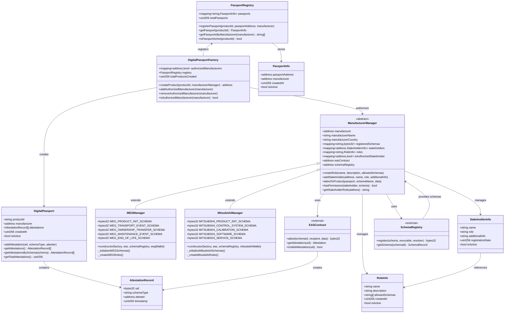
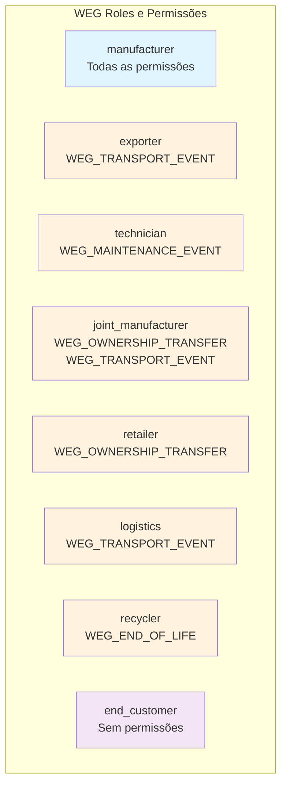
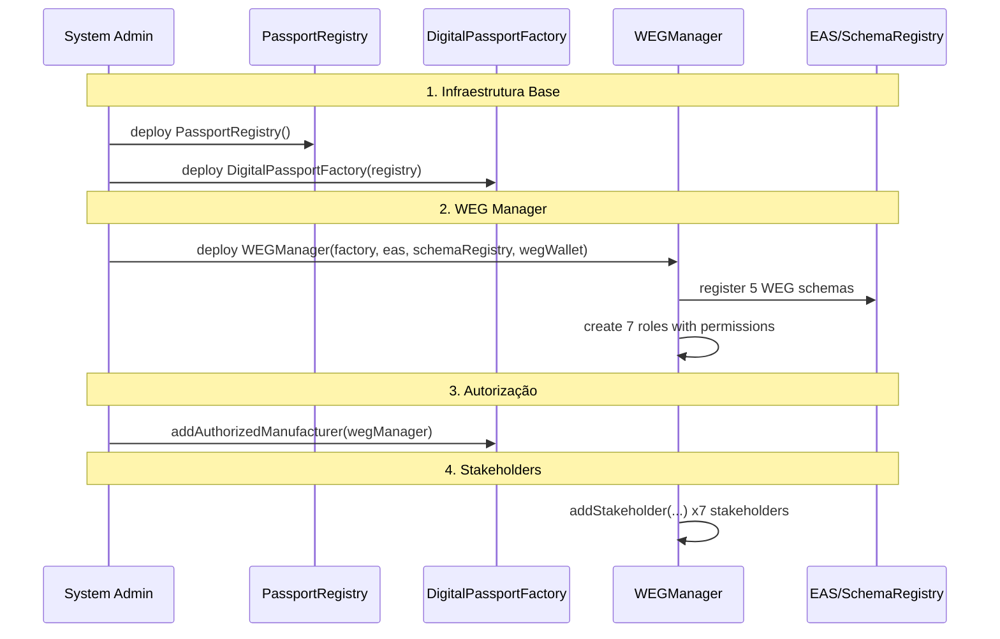
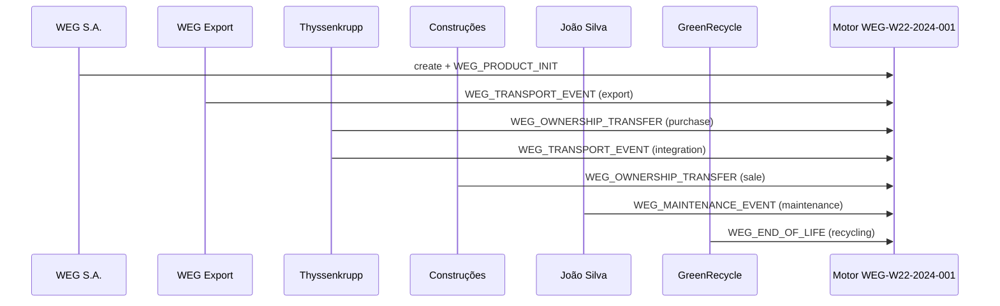

# Diagrama de Classes - Arquitetura Multi-Fabricante
## Sistema Completo WEG Digital Passport

### Visão Geral
Arquitetura baseada no documento **Exemplo-Uso-Multi-Fabricante** com:
- ✅ **Infraestrutura Base**: Registry + Factory
- ✅ **Sistema de Roles**: Permissões baseadas em roles, não stakeholders diretos
- ✅ **Schemas EAS**: 5 schemas para ciclo de vida completo
- ✅ **Stakeholders Reais**: 7 tipos de participantes da cadeia
- ✅ **Fluxo Completo**: Da fabricação à reciclagem

---

## Diagrama de Classes Atualizado



---

## Schemas Definidos (WEG)

### 📋 **Schemas do Ciclo de Vida WEG**

```solidity
// Schema 1: Inicialização do Produto
WEG_PRODUCT_INIT = "string productModel,string serialNumber,uint256 timestamp,string composition,string[] suppliers,string manufacturingLocation,string qualityStandards"

// Schema 2: Eventos de Transporte
WEG_TRANSPORT_EVENT = "string title,address responsible,address recipient,uint256 timestamp,string description,string origin,string destination,string trackingInfo"

// Schema 3: Transferência de Propriedade
WEG_OWNERSHIP_TRANSFER = "address previousOwner,address newOwner,uint256 timestamp,string transferType,string contractReference,uint256 transferValue,string description"

// Schema 4: Eventos de Manutenção
WEG_MAINTENANCE_EVENT = "string eventType,address technician,uint256 timestamp,string maintenanceType,string description,string[] partsReplaced,string nextScheduledMaintenance"

// Schema 5: Fim da Vida Útil
WEG_END_OF_LIFE = "uint256 timestamp,string reason,address finalizer,string condition,string disposalMethod,address recycler,string environmentalImpact"
```

---

## Sistema de Roles e Permissões

### 🔐 **Roles WEG Definidas**



### 👥 **Stakeholders WEG Reais**

| Stakeholder | Role | Permissões Herdadas |
|-------------|------|-------------------|
| **WEG S.A.** | `manufacturer` | Todas as permissões |
| **WEG Export Brasil** | `exporter` | `WEG_TRANSPORT_EVENT` |
| **João Silva** | `technician` | `WEG_MAINTENANCE_EVENT` |
| **Thyssenkrupp Elevadores** | `joint_manufacturer` | `WEG_OWNERSHIP_TRANSFER`, `WEG_TRANSPORT_EVENT` |
| **Construções Brasil Ltda** | `retailer` | `WEG_OWNERSHIP_TRANSFER` |
| **Maersk Line** | `logistics` | `WEG_TRANSPORT_EVENT` |
| **GreenRecycle Brasil** | `recycler` | `WEG_END_OF_LIFE` |
| **Condomínio Minha Casa** | `end_customer` | Apenas consulta |

---

## Fluxo de Trabalho Completo

### 🔄 **Sequência de Inicialização**



### 🏭 **Fluxo de Produto (Motor WEG W22 100HP)**



---

## Vantagens da Arquitetura Atualizada

### ✅ **Sistema de Roles Escalável**
- Permissões centralizadas nas roles, não nos stakeholders
- Fácil adicionar novos stakeholders à roles existentes
- Mudanças na role afetam todos os stakeholders automaticamente

### ✅ **Rastreabilidade Completa**
- 5 schemas cobrem todo o ciclo de vida
- Dados estruturados para cada tipo de evento
- Histórico imutável na blockchain

### ✅ **Independência entre Fabricantes**
- WEG e Mitsubishi operam completamente separados
- Schemas próprios para cada fabricante
- Impossibilidade de interferência cruzada

### ✅ **Compliance Regulatório**
- Schemas atendem regulamentações europeias
- Rastreabilidade completa origem → descarte
- Dados auditáveis e verificáveis

### ✅ **Infraestrutura Robusta**
- Registry centralizado para indexação
- Factory controlada para criação
- EAS para imutabilidade das attestations

---

## Estado Atual do Sistema

### 📊 **Exemplo Real - Motor WEG W22 100HP**

- **Product ID**: `WEG-W22-2024-001`
- **Passport Address**: `0x123...abc`
- **Total Attestations**: 9 attestations
- **Ciclo de Vida**: 15 anos (2024-2039)
- **Stakeholders Envolvidos**: 7 diferentes
- **Países**: Brasil → Alemanha
- **Status Final**: Reciclado (95% materiais recuperados)

### 🔍 **Capacidades de Consulta**

```solidity
// Consultas por produto
registry.getPassport("WEG-W22-2024-001")
passport.getAttestations()
passport.getAttestationsBySchema("WEG_MAINTENANCE_EVENT")

// Consultas por fabricante
registry.getPassportsByManufacturer(wegManager)
wegManager.getStakeholders()
wegManager.getStakeholderRole(joaoSilvaAddress)

// Verificações de permissão
wegManager.hasPermission(joaoSilvaAddress, "WEG_MAINTENANCE_EVENT") // true
wegManager.hasPermission(joaoSilvaAddress, "WEG_OWNERSHIP_TRANSFER") // false
```

---

**Documento**: Diagrama de Classes Multi-Fabricante  
**Status**: Atualizado com Base no Exemplo de Uso Completo 