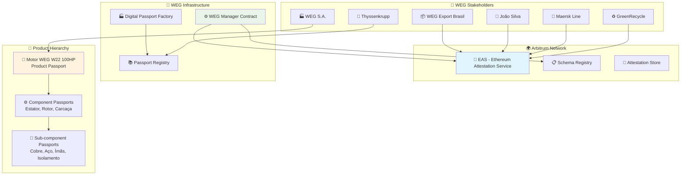

# EAS Architecture - Ethereum Attestation Service para WEG Digital Passport
## Arquitetura Atualizada - Junho 2025

---

## 🎯 **Visão Geral**

A **Ethereum Attestation Service (EAS)** é o protocolo descentralizado que utilizamos para criar **attestations** (atestados) on-chain sobre todos os eventos do ciclo de vida dos produtos WEG. Esta arquitetura suporta **rastreabilidade completa** desde componentes individuais até produtos finais.

### **Características da EAS para WEG:**

- ✅ **Rastreabilidade hierárquica**: Produtos → Componentes → Sub-componentes
- ✅ **Schemas WEG específicos**: 5 schemas otimizados para o ciclo de vida industrial
- ✅ **Sistema de roles granular**: 8 tipos de stakeholders com permissões específicas
- ✅ **Multi-fabricante**: Arquitetura que suporta WEG + outros fabricantes
- ✅ **Compliance automático**: Atendimento a regulamentações internacionais

---

## 🏗️ **Arquitetura WEG Digital Passport**

### **Estrutura Hierárquica Implementada:**



---

## 📋 **Schemas WEG Definidos**

### **Schema 1: WEG_PRODUCT_INIT**

```typescript
interface WEGProductInitSchema {
  productModel: string;        // "W22 IE4 100HP"
  serialNumber: string;        // "WEG-W22-2025-001"
  timestamp: number;           // Data de fabricação
  composition: string;         // "Aço reciclado 85%, Cobre certificado"
  suppliers: string[];         // ["Gerdau-BR", "Codelco-CL", "Elantas-DE"]
  manufacturingLocation: string; // "Jaraguá do Sul, SC, Brasil"
  qualityStandards: string;    // "ISO 9001, IEC 60034, NEMA MG-1"
}

// Schema UID registrado na EAS
const WEG_PRODUCT_INIT_SCHEMA = "0x1a2b3c4d...";
```

### **Schema 2: WEG_TRANSPORT_EVENT**

```typescript
interface WEGTransportEventSchema {
  title: string;               // "Exportação para Alemanha"
  responsible: address;        // Endereço do responsável pelo transporte
  recipient: address;          // Endereço do destinatário
  timestamp: number;           // Data/hora do evento
  description: string;         // Descrição detalhada do transporte
  origin: string;              // "Porto de Itajaí, SC, Brasil"
  destination: string;         // "Porto de Hamburgo, Alemanha"
  trackingInfo: string;        // "Container MSKU123456789, Navio Ever Given"
}

// Schema UID registrado na EAS
const WEG_TRANSPORT_EVENT_SCHEMA = "0x2b3c4d5e...";
```

### **Schema 3: WEG_OWNERSHIP_TRANSFER**

```typescript
interface WEGOwnershipTransferSchema {
  previousOwner: address;      // Endereço do proprietário anterior
  newOwner: address;          // Endereço do novo proprietário
  timestamp: number;          // Data da transferência
  transferType: string;       // "sale", "lease", "integration", "inheritance"
  contractReference: string;  // Referência do contrato de venda
  transferValue: number;      // Valor da transação (em wei)
  description: string;        // "Venda para integração em elevador"
}

// Schema UID registrado na EAS
const WEG_OWNERSHIP_TRANSFER_SCHEMA = "0x3c4d5e6f...";
```

### **Schema 4: WEG_MAINTENANCE_EVENT**

```typescript
interface WEGMaintenanceEventSchema {
  eventType: string;          // "preventive", "corrective", "upgrade", "inspection"
  technician: address;        // Endereço do técnico responsável
  timestamp: number;          // Data da manutenção
  maintenanceType: string;    // Tipo específico da manutenção
  description: string;        // "Substituição de rolamentos, lubrificação"
  partsReplaced: string[];    // ["SKF-6312-2RS1", "Shell Omala S2 G 220"]
  nextScheduledMaintenance: string; // "2026-07-15T10:00:00Z"
}

// Schema UID registrado na EAS
const WEG_MAINTENANCE_EVENT_SCHEMA = "0x4d5e6f7a...";
```

### **Schema 5: WEG_END_OF_LIFE**

```typescript
interface WEGEndOfLifeSchema {
  timestamp: number;          // Data do fim de vida
  reason: string;             // "obsolescence", "failure", "upgrade", "planned"
  finalizer: address;         // Quem finalizou o ciclo de vida
  condition: string;          // "95% materials recoverable"
  disposalMethod: string;     // "recycling", "refurbishment", "secure_disposal"
  recycler: address;          // Endereço da empresa recicladora
  environmentalImpact: string; // "-2.3 ton CO₂ equivalent"
}

// Schema UID registrado na EAS
const WEG_END_OF_LIFE_SCHEMA = "0x5e6f7a8b...";
```

---

## 🔧 **Rastreabilidade Hierárquica de Componentes**

### **Estrutura de Attestations por Componente:**

```typescript
// 1. Produto Principal
const motorAttestation = await eas.attest({
  schema: WEG_PRODUCT_INIT_SCHEMA,
  data: {
    productModel: "W22 IE4 100HP",
    serialNumber: "WEG-W22-2025-001",
    timestamp: Date.now(),
    composition: "Aço reciclado 85%, Cobre certificado livre de conflito",
    suppliers: ["Gerdau-BR", "Codelco-CL", "SKF-SE", "Elantas-DE"],
    manufacturingLocation: "Jaraguá do Sul, SC, Brasil",
    qualityStandards: "ISO 9001:2015, IEC 60034-1, NEMA MG-1"
  },
  recipient: "0x..." // Endereço do DigitalPassport
});

// 2. Componente Estator
const statorAttestation = await eas.attest({
  schema: WEG_PRODUCT_INIT_SCHEMA, // Mesmo schema, dados específicos
  data: {
    productModel: "Estator W22-100HP",
    serialNumber: "WEG-ST-2025-4521",
    timestamp: Date.now(),
    composition: "Fio de cobre OFHC 99.95%, Isolamento Classe F",
    suppliers: ["Codelco-CL", "Elantas-DE"],
    manufacturingLocation: "Jaraguá do Sul, SC, Brasil",
    qualityStandards: "IEC 60317-3, UL 1446"
  },
  recipient: "0x..." // Endereço do motor principal
});

// 3. Sub-componente Cobre
const copperAttestation = await eas.attest({
  schema: WEG_PRODUCT_INIT_SCHEMA,
  data: {
    productModel: "Fio de Cobre OFHC",
    serialNumber: "CODELCO-CU-2025-9876",
    timestamp: Date.now(),
    composition: "Cobre eletrolítico 99.95%, livre de conflito",
    suppliers: ["Codelco-Chile"],
    manufacturingLocation: "Mina El Teniente, Chile",
    qualityStandards: "ASTM B49, ISO 6301"
  },
  recipient: "0x..." // Endereço do estator
});
```

### **Vinculação Hierárquica:**

```solidity
// Estrutura para rastrear hierarquia de componentes
struct ComponentHierarchy {
    bytes32 parentPassportUID;      // UID do passaporte pai
    bytes32[] childPassportUIDs;    // UIDs dos passaportes filhos
    uint8 hierarchyLevel;           // 0=Produto, 1=Componente, 2=Sub-componente
    string componentType;           // "motor", "stator", "copper_wire"
}

mapping(bytes32 => ComponentHierarchy) public componentHierarchy;

// Função para vincular componente ao produto
function linkComponentToProduct(
    bytes32 productUID,
    bytes32 componentUID,
    uint8 level,
    string memory componentType
) external onlyAuthorized {
    componentHierarchy[componentUID] = ComponentHierarchy({
        parentPassportUID: productUID,
        childPassportUIDs: new bytes32[](0),
        hierarchyLevel: level,
        componentType: componentType
    });
    
    componentHierarchy[productUID].childPassportUIDs.push(componentUID);
}
```

---

## 👥 **Sistema de Roles WEG**

### **Roles Definidas e Permissões:**

```typescript
enum WEGRole {
    MANUFACTURER = 0,      // WEG S.A. - Todas as permissões
    EXPORTER = 1,         // WEG Export Brasil - WEG_TRANSPORT_EVENT
    TECHNICIAN = 2,       // João Silva - WEG_MAINTENANCE_EVENT
    JOINT_MANUFACTURER = 3, // Thyssenkrupp - WEG_OWNERSHIP_TRANSFER, WEG_TRANSPORT_EVENT
    RETAILER = 4,         // Construções Brasil - WEG_OWNERSHIP_TRANSFER
    LOGISTICS = 5,        // Maersk Line - WEG_TRANSPORT_EVENT
    RECYCLER = 6,         // GreenRecycle - WEG_END_OF_LIFE
    END_CUSTOMER = 7      // Condomínio - Apenas consulta
}

// Matriz de permissões por role e schema
const ROLE_PERMISSIONS = {
    [WEGRole.MANUFACTURER]: {
        [WEG_PRODUCT_INIT_SCHEMA]: true,
        [WEG_TRANSPORT_EVENT_SCHEMA]: true,
        [WEG_OWNERSHIP_TRANSFER_SCHEMA]: true,
        [WEG_MAINTENANCE_EVENT_SCHEMA]: true,
        [WEG_END_OF_LIFE_SCHEMA]: true
    },
    [WEGRole.EXPORTER]: {
        [WEG_TRANSPORT_EVENT_SCHEMA]: true
    },
    [WEGRole.TECHNICIAN]: {
        [WEG_MAINTENANCE_EVENT_SCHEMA]: true
    },
    [WEGRole.JOINT_MANUFACTURER]: {
        [WEG_OWNERSHIP_TRANSFER_SCHEMA]: true,
        [WEG_TRANSPORT_EVENT_SCHEMA]: true
    },
    [WEGRole.RETAILER]: {
        [WEG_OWNERSHIP_TRANSFER_SCHEMA]: true
    },
    [WEGRole.LOGISTICS]: {
        [WEG_TRANSPORT_EVENT_SCHEMA]: true
    },
    [WEGRole.RECYCLER]: {
        [WEG_END_OF_LIFE_SCHEMA]: true
    },
    [WEGRole.END_CUSTOMER]: {
        // Apenas consulta, nenhuma permissão de criação
    }
};
```

### **Stakeholders WEG Registrados:**

```typescript
const WEG_STAKEHOLDERS = [
    {
        address: "0x1234...",
        name: "WEG S.A.",
        role: WEGRole.MANUFACTURER,
        additionalInfo: "Fabricante original - Jaraguá do Sul, SC"
    },
    {
        address: "0x2345...",
        name: "WEG Export Brasil",
        role: WEGRole.EXPORTER,
        additionalInfo: "Departamento de exportação WEG"
    },
    {
        address: "0x3456...",
        name: "João Silva",
        role: WEGRole.TECHNICIAN,
        additionalInfo: "Técnico certificado WEG - ID: WEG-TECH-001"
    },
    {
        address: "0x4567...",
        name: "Thyssenkrupp Elevadores Brasil",
        role: WEGRole.JOINT_MANUFACTURER,
        additionalInfo: "Integrador de elevadores"
    },
    {
        address: "0x5678...",
        name: "Construções Brasil Ltda",
        role: WEGRole.RETAILER,
        additionalInfo: "Distribuidor autorizado WEG"
    },
    {
        address: "0x6789...",
        name: "Maersk Line Brasil",
        role: WEGRole.LOGISTICS,
        additionalInfo: "Transportadora marítima internacional"
    },
    {
        address: "0x7890...",
        name: "GreenRecycle Brasil",
        role: WEGRole.RECYCLER,
        additionalInfo: "Reciclagem de equipamentos elétricos"
    },
    {
        address: "0x8901...",
        name: "Condomínio Residencial Minha Casa",
        role: WEGRole.END_CUSTOMER,
        additionalInfo: "Cliente final - Uso em elevador"
    }
];
```

---

## 🔄 **Fluxo Completo de Attestations**

### **Exemplo Real: Motor WEG W22 100HP (Ciclo 2025-2040)**

```typescript
// 1. Fabricação - Julho 2025
const productCreation = await eas.attest({
    schema: WEG_PRODUCT_INIT_SCHEMA,
    data: {
        productModel: "W22 IE4 100HP",
        serialNumber: "WEG-W22-2025-001",
        timestamp: 1721836800, // 24 Jul 2025
        composition: "Aço reciclado 85%, Cobre certificado livre de conflito",
        suppliers: ["Gerdau-BR", "Codelco-CL", "SKF-SE", "Elantas-DE"],
        manufacturingLocation: "Jaraguá do Sul, SC, Brasil",
        qualityStandards: "ISO 9001:2015, IEC 60034-1, NEMA MG-1"
    },
    attester: WEG_SA_ADDRESS
});

// 2. Exportação - Agosto 2025
const exportEvent = await eas.attest({
    schema: WEG_TRANSPORT_EVENT_SCHEMA,
    data: {
        title: "Exportação para Alemanha",
        responsible: WEG_EXPORT_ADDRESS,
        recipient: THYSSENKRUPP_ADDRESS,
        timestamp: 1722614400, // 2 Aug 2025
        description: "Transporte marítimo em container refrigerado",
        origin: "Porto de Itajaí, SC, Brasil",
        destination: "Porto de Hamburgo, Alemanha",
        trackingInfo: "Container MSKU789123456, Navio CMA CGM Antoine De Saint Exupery"
    },
    attester: WEG_EXPORT_ADDRESS
});

// 3. Transferência de Propriedade - Setembro 2025
const ownershipTransfer = await eas.attest({
    schema: WEG_OWNERSHIP_TRANSFER_SCHEMA,
    data: {
        previousOwner: WEG_SA_ADDRESS,
        newOwner: THYSSENKRUPP_ADDRESS,
        timestamp: 1725148800, // 1 Sep 2025
        transferType: "integration",
        contractReference: "TKE-BR-2025-4567",
        transferValue: ethers.utils.parseEther("25"), // €25,000 em ETH
        description: "Compra para integração em elevador residencial"
    },
    attester: THYSSENKRUPP_ADDRESS
});

// 4. Evento de Transporte Interno - Setembro 2025
const internalTransport = await eas.attest({
    schema: WEG_TRANSPORT_EVENT_SCHEMA,
    data: {
        title: "Transporte para instalação",
        responsible: THYSSENKRUPP_ADDRESS,
        recipient: THYSSENKRUPP_ADDRESS,
        timestamp: 1725753600, // 8 Sep 2025
        description: "Transporte terrestre para obra",
        origin: "Centro de Distribuição Thyssenkrupp - Hamburgo",
        destination: "Condomínio Residencial Minha Casa - São Paulo, SP",
        trackingInfo: "Caminhão TKE-SP-001, Motorista Hans Mueller"
    },
    attester: THYSSENKRUPP_ADDRESS
});

// 5. Transferência para Cliente Final - Setembro 2025
const finalSale = await eas.attest({
    schema: WEG_OWNERSHIP_TRANSFER_SCHEMA,
    data: {
        previousOwner: THYSSENKRUPP_ADDRESS,
        newOwner: CONSTRUCOES_BRASIL_ADDRESS,
        timestamp: 1726358400, // 15 Sep 2025
        transferType: "sale",
        contractReference: "CB-ELEVADOR-2025-789",
        transferValue: ethers.utils.parseEther("45"), // R$45,000 em ETH equivalente
        description: "Venda de elevador completo incluindo motor WEG"
    },
    attester: CONSTRUCOES_BRASIL_ADDRESS
});

// 6. Primeira Manutenção - Setembro 2026 (1 ano depois)
const firstMaintenance = await eas.attest({
    schema: WEG_MAINTENANCE_EVENT_SCHEMA,
    data: {
        eventType: "preventive",
        technician: JOAO_SILVA_ADDRESS,
        timestamp: 1757894400, // 15 Sep 2026
        maintenanceType: "annual_inspection",
        description: "Inspeção anual preventiva - lubrificação, verificação de vibração",
        partsReplaced: ["Shell Omala S2 G 220 - 2L"],
        nextScheduledMaintenance: "2027-09-15T10:00:00Z"
    },
    attester: JOAO_SILVA_ADDRESS
});

// 7. Manutenção Corretiva - Março 2030 (5 anos)
const correctiveMaintenance = await eas.attest({
    schema: WEG_MAINTENANCE_EVENT_SCHEMA,
    data: {
        eventType: "corrective",
        technician: JOAO_SILVA_ADDRESS,
        timestamp: 1896134400, // 15 Mar 2030
        maintenanceType: "bearing_replacement",
        description: "Substituição de rolamentos devido a ruído excessivo",
        partsReplaced: ["SKF-6312-2RS1", "SKF-6308-2RS1", "Shell Omala S2 G 220 - 2L"],
        nextScheduledMaintenance: "2030-09-15T10:00:00Z"
    },
    attester: JOAO_SILVA_ADDRESS
});

// 8. Fim de Vida - Julho 2040 (15 anos)
const endOfLife = await eas.attest({
    schema: WEG_END_OF_LIFE_SCHEMA,
    data: {
        timestamp: 2215267200, // 24 Jul 2040
        reason: "obsolescence",
        finalizer: GREENRECYCLE_ADDRESS,
        condition: "95% dos materiais recuperáveis",
        disposalMethod: "recycling",
        recycler: GREENRECYCLE_ADDRESS,
        environmentalImpact: "-2.3 ton CO₂ equivalent, 125kg de cobre recuperado"
    },
    attester: GREENRECYCLE_ADDRESS
});
```

---

## 🛡️ **Resolver Contract WEG**

### **Controle de Acesso Personalizado:**

```solidity
// SPDX-License-Identifier: MIT
pragma solidity ^0.8.19;

import "@ethereum-attestation-service/eas-contracts/contracts/resolver/SchemaResolver.sol";

contract WEGPassportResolver is SchemaResolver {
    
    // Endereço do WEG Manager autorizado
    address public immutable wegManager;
    
    // Mapping de roles por endereço
    mapping(address => WEGRole) public stakeholderRoles;
    
    // Mapping de permissões por schema e role
    mapping(bytes32 => mapping(WEGRole => bool)) public schemaPermissions;
    
    enum WEGRole {
        NONE,
        MANUFACTURER,
        EXPORTER,
        TECHNICIAN,
        JOINT_MANUFACTURER,
        RETAILER,
        LOGISTICS,
        RECYCLER,
        END_CUSTOMER
    }
    
    constructor(IEAS eas, address _wegManager) SchemaResolver(eas) {
        wegManager = _wegManager;
        
        // Configurar permissões iniciais
        _setupInitialPermissions();
    }
    
    function onAttest(
        Attestation calldata attestation,
        uint256 /*value*/
    ) internal override returns (bool) {
        // Verificar se o attester tem permissão para este schema
        WEGRole role = stakeholderRoles[attestation.attester];
        bytes32 schema = attestation.schema;
        
        require(
            schemaPermissions[schema][role],
            "WEGResolver: Unauthorized role for this schema"
        );
        
        // Validações específicas por schema
        if (schema == WEG_PRODUCT_INIT_SCHEMA) {
            require(
                role == WEGRole.MANUFACTURER,
                "Only manufacturer can create products"
            );
        } else if (schema == WEG_MAINTENANCE_EVENT_SCHEMA) {
            require(
                role == WEGRole.TECHNICIAN || role == WEGRole.MANUFACTURER,
                "Only technicians can perform maintenance"
            );
        }
        
        return true;
    }
    
    function onRevoke(
        Attestation calldata /*attestation*/,
        uint256 /*value*/
    ) internal pure override returns (bool) {
        // WEG Digital Passports são imutáveis - não permite revogação
        return false;
    }
    
    function _setupInitialPermissions() private {
        // MANUFACTURER - todas as permissões
        schemaPermissions[WEG_PRODUCT_INIT_SCHEMA][WEGRole.MANUFACTURER] = true;
        schemaPermissions[WEG_TRANSPORT_EVENT_SCHEMA][WEGRole.MANUFACTURER] = true;
        schemaPermissions[WEG_OWNERSHIP_TRANSFER_SCHEMA][WEGRole.MANUFACTURER] = true;
        schemaPermissions[WEG_MAINTENANCE_EVENT_SCHEMA][WEGRole.MANUFACTURER] = true;
        schemaPermissions[WEG_END_OF_LIFE_SCHEMA][WEGRole.MANUFACTURER] = true;
        
        // EXPORTER - apenas transporte
        schemaPermissions[WEG_TRANSPORT_EVENT_SCHEMA][WEGRole.EXPORTER] = true;
        
        // TECHNICIAN - apenas manutenção
        schemaPermissions[WEG_MAINTENANCE_EVENT_SCHEMA][WEGRole.TECHNICIAN] = true;
        
        // JOINT_MANUFACTURER - transferência e transporte
        schemaPermissions[WEG_OWNERSHIP_TRANSFER_SCHEMA][WEGRole.JOINT_MANUFACTURER] = true;
        schemaPermissions[WEG_TRANSPORT_EVENT_SCHEMA][WEGRole.JOINT_MANUFACTURER] = true;
        
        // RETAILER - apenas transferência
        schemaPermissions[WEG_OWNERSHIP_TRANSFER_SCHEMA][WEGRole.RETAILER] = true;
        
        // LOGISTICS - apenas transporte
        schemaPermissions[WEG_TRANSPORT_EVENT_SCHEMA][WEGRole.LOGISTICS] = true;
        
        // RECYCLER - apenas fim de vida
        schemaPermissions[WEG_END_OF_LIFE_SCHEMA][WEGRole.RECYCLER] = true;
        
        // END_CUSTOMER - nenhuma permissão de criação
    }
    
    // Função para o WEG Manager registrar stakeholders
    function registerStakeholder(
        address stakeholder,
        WEGRole role
    ) external {
        require(msg.sender == wegManager, "Only WEG Manager");
        stakeholderRoles[stakeholder] = role;
    }
}
```

---

## 📊 **Benefícios da Arquitetura EAS para WEG**

### **🔧 Técnicos:**
- **Interoperabilidade**: Padrão aberto integrado com outros fabricantes
- **Escalabilidade**: Arbitrum suporta milhões de attestations
- **Flexibilidade**: Schemas podem ser atualizados conforme necessário
- **Verificabilidade**: Criptograficamente seguro e auditável
- **Hierarquia**: Rastreabilidade desde matéria-prima até produto final

### **💼 Operacionais:**
- **Redução de Custos**: Sem blockchain proprietária
- **Facilidade de Integração**: APIs e SDKs bem documentados
- **Padrão da Indústria**: Protocolo adotado globalmente
- **Governança Descentralizada**: Múltiplos stakeholders podem participar
- **Automação**: Integração direta com sistemas WEG existentes

### **🏛️ Regulatórios:**
- **Transparência**: Todos os eventos verificáveis publicamente
- **Imutabilidade**: Registros não podem ser alterados
- **Auditabilidade**: Trilha completa de responsabilidades
- **Compliance**: Atendimento automático a regulamentações EU

### **♻️ Sustentabilidade:**
- **Pegada de carbono precisa**: Cálculo por componente
- **Reciclagem otimizada**: Conhecimento exato dos materiais
- **Economia circular**: Reutilização inteligente de componentes
- **Materiais livres de conflito**: Certificação de origem

---

## 🚀 **Integração com Sistemas WEG**

### **1. ERP Integration:**

```typescript
// Webhook para notificar ERP quando produto é criado
app.post('/webhook/product-created', async (req, res) => {
  const { productId, attestationUID, timestamp } = req.body;
  
  // Atualizar SAP/Oracle com dados do passaporte
  await sapConnector.updateProduct({
    productId,
    blockchainUID: attestationUID,
    passportStatus: 'ACTIVE',
    lastUpdate: timestamp
  });
  
  res.status(200).json({ success: true });
});

// SDK para sistemas WEG
const wegPassport = new WEGPassportSDK({
  network: 'arbitrum',
  wegManagerAddress: '0x123...',
  apiKey: process.env.WEG_API_KEY
});

// Criar passaporte diretamente do ERP
const passport = await wegPassport.createProduct({
  model: 'W22 IE4 100HP',
  serialNumber: 'WEG-W22-2025-001',
  manufacturingData: {
    location: 'Jaraguá do Sul',
    date: new Date(),
    composition: 'Aço reciclado 85%',
    qualityTests: ['ISO 9001', 'IEC 60034']
  }
});
```

### **2. IoT Integration:**

```typescript
// Sensores IoT reportando dados automaticamente
class WEGMotorSensor {
  constructor(productId, passportAddress) {
    this.productId = productId;
    this.passportAddress = passportAddress;
  }
  
  // Reportar dados de operação em tempo real
  async reportOperationData() {
    const sensorData = {
      temperature: this.readTemperature(),
      vibration: this.readVibration(),
      powerConsumption: this.readPower(),
      timestamp: Date.now()
    };
    
    // Se anomalia detectada, criar attestation de manutenção
    if (this.detectAnomaly(sensorData)) {
      await wegPassport.createMaintenanceAlert({
        productId: this.productId,
        alertType: 'anomaly_detected',
        sensorData,
        urgency: 'high'
      });
    }
  }
}
```

---

## 🎯 **Roadmap de Implementação EAS**

### **Fase 1: Infraestrutura Base (Q3-Q4 2025)**
- ✅ **Deploy dos 5 schemas WEG** na Arbitrum
- ✅ **WEG Resolver Contract** com sistema de roles
- ✅ **Registro de 8 stakeholders** iniciais
- ✅ **Primeiros 100 produtos** com passaportes completos

### **Fase 2: Componentes e Hierarquia (Q1-Q2 2026)**
- 🔧 **Rastreabilidade de componentes** em 1.000 produtos
- 🏭 **Integração total com linha de produção** WEG
- 🤝 **Onboarding de fornecedores** (SKF, Gerdau, Codelco)
- 📊 **Dashboard WEG** para visualização de attestations

### **Fase 3: Escala Global (2026-2027)**
- 🌎 **Todos os produtos WEG** com passaportes
- 🏭 **Outros fabricantes** integrados na mesma rede
- 🤖 **IoT automation** completa
- 📈 **Analytics avançado** e insights de negócio

---

**Documento**: EAS Architecture - WEG Digital Passport  
**Versão**: 3.0  
**Data**: Junho 2025  
**Status**: Arquitetura Definida e Implementação em Andamento 