# Exemplo de Uso - Arquitetura Multi-Fabricante
## Criação da Infraestrutura e Manufacturers

### Visão Geral
Este documento mostra **exemplos práticos** de como usar a arquitetura multi-fabricante, começando pela infraestrutura base compartilhada e depois a criação dos managers específicos.

---

## 1. Criação da Infraestrutura Base

### Diagrama de Sequência - Infraestrutura Base

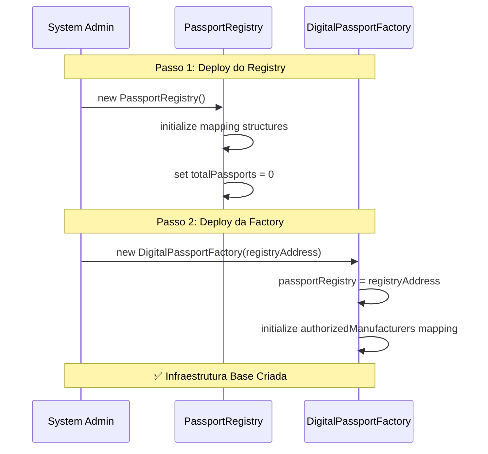

### Detalhes da Infraestrutura Base

**Componentes Criados:**
- ✅ **PassportRegistry**: Indexação e busca de passaportes
- ✅ **DigitalPassportFactory**: Criação de passaportes únicos  

**Componentes de Código (Não Deployados):**
- 📄 **ManufacturerManager.sol**: Contrato abstrato base (apenas código)

**Componentes Existentes (Arbitrum):**
- 🌐 **EAS Contract**: Já existente na rede Arbitrum
- 🌐 **Schema Registry**: Já existente na rede Arbitrum

**Estado Inicial:**
- 🔹 **authorizedManufacturers**: Vazio (nenhum fabricante autorizado)
- 🔹 **totalPassports**: 0
- 🔹 **Schemas**: Nenhum criado ainda

---

## 2. Criação do WEG Manager

### Diagrama de Sequência - WEG Manager


### Detalhes da Criação WEG

**Como Funciona a Herança:**
- 🔧 **Compilação**: `WEGManager.sol` + `ManufacturerManager.sol` = contrato único
- 📦 **Deploy**: Apenas o `WEGManager` (com código herdado embutido)
- 🎯 **Resultado**: Um contrato na blockchain com todas as funcionalidades

**Estado do WEG Manager:**
- ✅ **Endereço**: `wegManagerAddress`
- ✅ **Manufacturer**: `wegWallet`
- ✅ **Nome**: "WEG S.A."
- ✅ **País**: "Brasil"
- ✅ **Autorizado na Factory**: Sim
- ✅ **Stakeholder Principal**: wegWallet como "manufacturer"
- ⏳ **Schemas**: Nenhum criado ainda
- ⏳ **Produtos**: Nenhum criado ainda

---

## 3. Criação do Mitsubishi Manager

### Diagrama de Sequência - Mitsubishi Manager

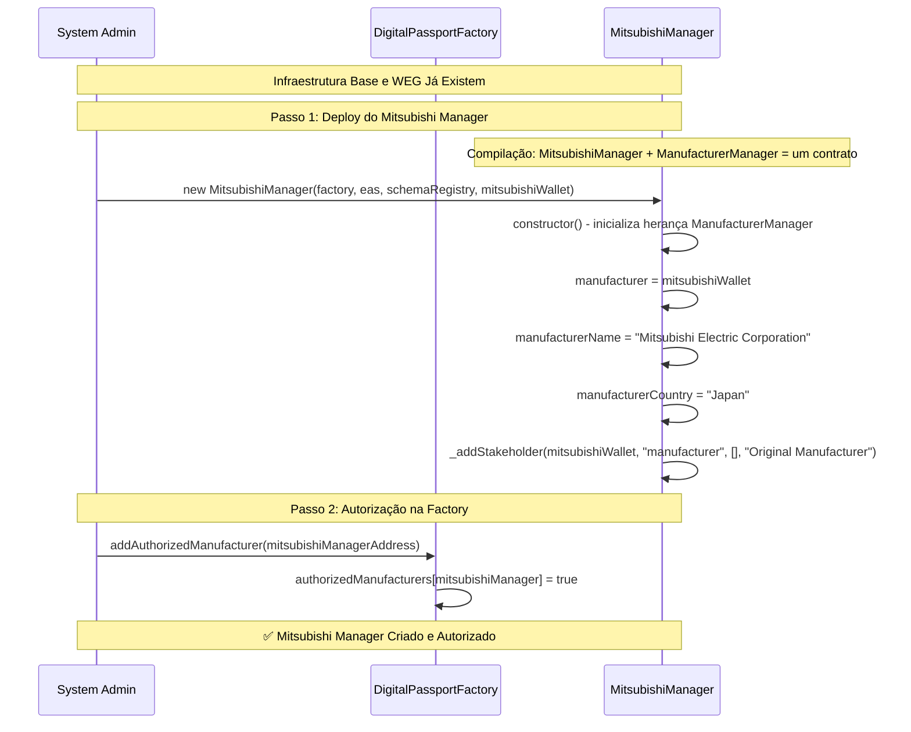

### Detalhes da Criação Mitsubishi

**Como Funciona a Herança:**
- 🔧 **Compilação**: `MitsubishiManager.sol` + `ManufacturerManager.sol` = contrato único
- 📦 **Deploy**: Apenas o `MitsubishiManager` (com código herdado embutido)
- 🎯 **Resultado**: Um contrato na blockchain com todas as funcionalidades

**Estado do Mitsubishi Manager:**
- ✅ **Endereço**: `mitsubishiManagerAddress`
- ✅ **Manufacturer**: `mitsubishiWallet`
- ✅ **Nome**: "Mitsubishi Electric Corporation"
- ✅ **País**: "Japan"
- ✅ **Autorizado na Factory**: Sim
- ✅ **Stakeholder Principal**: mitsubishiWallet como "manufacturer"
- ⏳ **Schemas**: Nenhum criado ainda
- ⏳ **Produtos**: Nenhum criado ainda

---

## 4. Estado Final Após Criação

### Resultado da Configuração

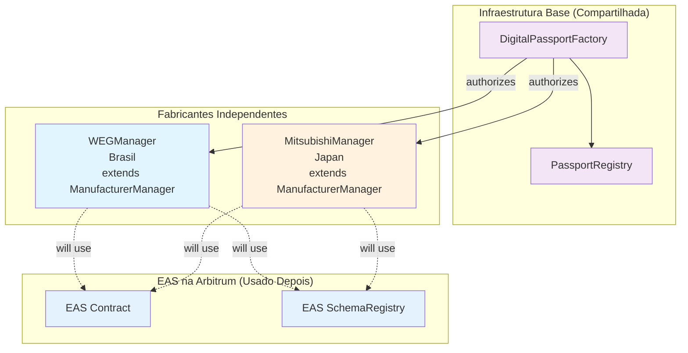

---

## 5. Próximos Passos

### ✅ **Concluído**
- ✅ **Infraestrutura Base**: Registry, Factory
- ✅ **WEG Manager**: Criado, autorizado, configurado
- ✅ **Mitsubishi Manager**: Criado, autorizado, configurado
- ✅ **Isolamento**: Cada fabricante opera independentemente

### 🔄 **Próximo: Definição de Roles e Permissões**
Definir que tipos de stakeholders cada fabricante terá:
- WEG: técnicos, exportadores, auditores
- Mitsubishi: engenheiros, calibradores, suporte técnico

### 🔄 **Depois: Criação de Schemas com Permissões**
Criar schemas específicos já sabendo quais roles podem usá-los

### 🔄 **Por Último: Adição de Stakeholders**
Adicionar pessoas/entidades específicas com roles definidas

---

## 6. Criação de Schemas EAS - WEG

### Visão Geral
Antes de cadastrar stakeholders, a WEG precisa criar os schemas EAS que serão usados para diferentes tipos de attestations durante o ciclo de vida dos produtos.

### Diagrama de Sequência - Criação de Schemas EAS

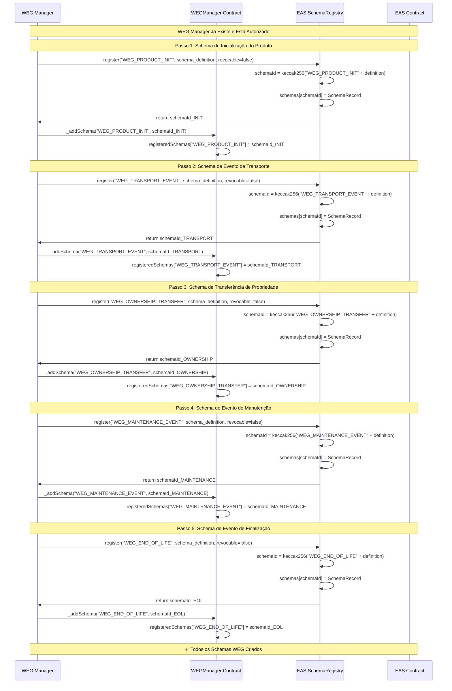

### Detalhes dos Schemas Criados

#### **1️⃣ Schema de Inicialização do Produto**
- **Nome**: `WEG_PRODUCT_INIT`
- **Função**: Inicializar o passaporte digital com informações de criação
- **Campos**:
  ```solidity
  string productModel,        // Modelo do produto (ex: "WEG W22 100HP")
  string serialNumber,        // Número de série único
  uint256 timestamp,          // Timestamp de fabricação
  string composition,         // Composição e materiais
  string[] suppliers,         // Fornecedores de componentes/matéria-prima
  string manufacturingLocation, // Local de fabricação
  string qualityStandards     // Padrões de qualidade aplicados
  ```

#### **2️⃣ Schema de Evento de Transporte**
- **Nome**: `WEG_TRANSPORT_EVENT`
- **Função**: Registrar eventos de transporte/movimentação
- **Campos**:
  ```solidity
  string title,               // Título do evento (ex: "Produto iniciou transferência do Brasil para Europa")
  address responsible,        // Responsável pelo transporte (ex: transportadora)
  address recipient,          // Destinatário (opcional, pode ser address(0))
  uint256 timestamp,          // Timestamp do evento
  string description,         // Descrição detalhada
  string origin,              // Local de origem
  string destination,         // Local de destino
  string trackingInfo         // Informações de rastreamento
  ```

#### **3️⃣ Schema de Transferência de Propriedade**
- **Nome**: `WEG_OWNERSHIP_TRANSFER`
- **Função**: Registrar mudanças de propriedade do produto
- **Campos**:
  ```solidity
  address previousOwner,      // Proprietário anterior
  address newOwner,           // Novo proprietário
  uint256 timestamp,          // Timestamp da transferência
  string transferType,        // Tipo de transferência (venda, doação, etc.)
  string contractReference,   // Referência do contrato de venda (opcional)
  uint256 transferValue,      // Valor da transferência (opcional)
  string description          // Descrição da transferência
  ```

#### **4️⃣ Schema de Evento de Manutenção**
- **Nome**: `WEG_MAINTENANCE_EVENT`
- **Função**: Registrar início e fim de manutenções
- **Campos**:
  ```solidity
  string eventType,           // Tipo do evento ("START" ou "COMPLETE")
  address technician,         // Técnico responsável
  uint256 timestamp,          // Timestamp do evento
  string maintenanceType,     // Tipo de manutenção (preventiva, corretiva, etc.)
  string description,         // Descrição dos serviços
  string[] partsReplaced,     // Peças substituídas (se houver)
  string nextScheduledMaintenance // Próxima manutenção programada
  ```

#### **5️⃣ Schema de Evento de Finalização**
- **Nome**: `WEG_END_OF_LIFE`
- **Função**: Registrar quando produto chega ao fim da vida útil
- **Campos**:
  ```solidity
  uint256 timestamp,          // Timestamp da finalização
  string reason,              // Motivo da finalização (desgaste, obsolescência, etc.)
  address finalizer,          // Quem declarou o fim da vida útil
  string condition,           // Condição final do produto
  string disposalMethod,      // Método de descarte/reciclagem
  address recycler,           // Recicladora responsável (se aplicável)
  string environmentalImpact  // Impacto ambiental do descarte
  ```

---

## 7. Estado dos Schemas Criados

### Resultado da Configuração

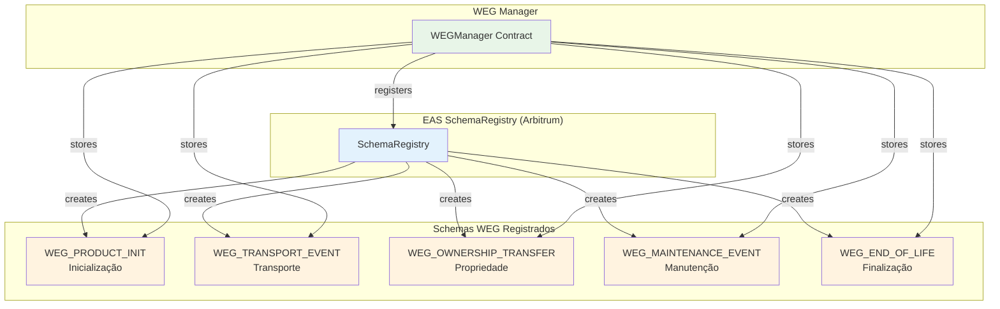

### Observações Importantes

#### **🔐 Sistema de Permissões Baseado em Roles:**
- **Roles definem permissões**: Cada role tem schemas específicos que pode usar
- **Stakeholders herdam permissões**: Quando atribuído a uma role, stakeholder ganha suas permissões
- **Gerenciamento centralizado**: Mudanças na role afetam todos os stakeholders dessa role
- **Escalabilidade**: Novos stakeholders só precisam ser atribuídos a roles existentes

#### **🎯 Mapeamento Role → Permissões:**
- **`exporter`** → `["WEG_TRANSPORT_EVENT"]`
- **`technician`** → `["WEG_MAINTENANCE_EVENT"]`
- **`joint_manufacturer`** → `["WEG_OWNERSHIP_TRANSFER", "WEG_TRANSPORT_EVENT"]`
- **`retailer`** → `["WEG_OWNERSHIP_TRANSFER"]`
- **`logistics`** → `["WEG_TRANSPORT_EVENT"]`
- **`recycler`** → `["WEG_END_OF_LIFE"]`
- **`end_customer`** → `[]` (apenas consulta)

#### **🏭 Cadeia de Valor com Roles:**
1. **WEG** (manufacturer) → Fabrica motor (`WEG_PRODUCT_INIT`)
2. **Thyssenkrupp** (joint_manufacturer) → Recebe motor e transporta elevador
3. **Construções Brasil** (retailer) → Vende elevador
4. **Condomínio** (end_customer) → Usa o elevador (consulta apenas)
5. **Maersk/WEG Export** (logistics/exporter) → Transporta
6. **João Silva** (technician) → Faz manutenções
7. **GreenRecycle** (recycler) → Recicla no fim da vida

#### **✅ Vantagens do Sistema de Roles:**
- **Consistência**: Todos stakeholders da mesma role têm mesmas permissões
- **Manutenibilidade**: Alterar uma role atualiza todos seus stakeholders
- **Segurança**: Permissões centralizadas e auditáveis
- **Flexibilidade**: Stakeholders podem mudar de role se necessário

#### **🎯 Próximos Passos:**
- ⏳ **Criação de Produtos**: Usando a factory para criar passaportes
- ⏳ **Attestations Práticas**: Stakeholders criam attestations baseados em suas roles
- ⏳ **Consultas**: Demonstrar como consultar o histórico completo

---

## 8. Criação de Roles - WEG

### Visão Geral
Antes de cadastrar stakeholders, a WEG precisa definir as roles (funções) que existirão no seu ecossistema. Cada role define um tipo de participante e suas responsabilidades gerais.

### Diagrama de Sequência - Criação de Roles WEG

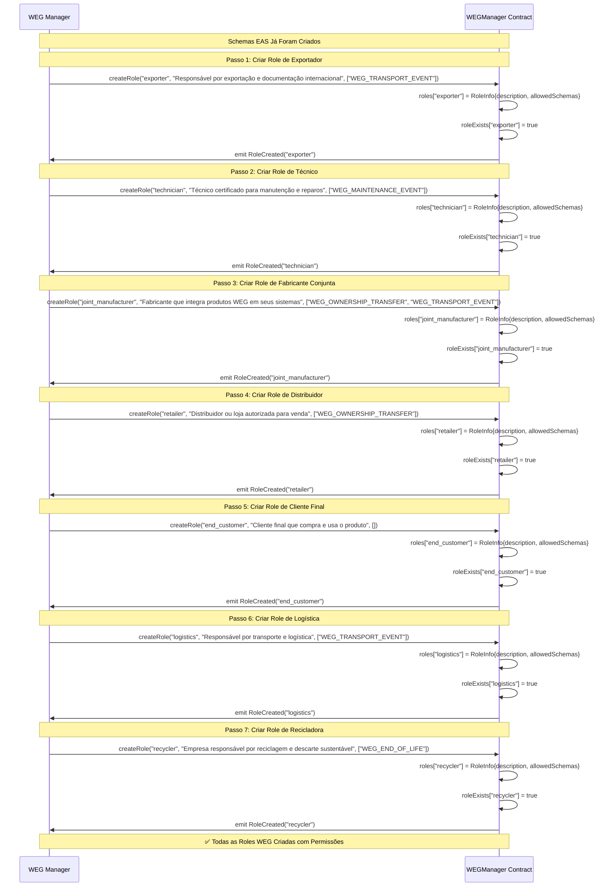

### Detalhes das Roles Criadas

#### **1️⃣ Role: Exporter**
- **Nome**: `exporter`
- **Descrição**: "Responsável por exportação e documentação internacional"
- **Schemas Permitidos**: `["WEG_TRANSPORT_EVENT"]`
- **Propósito**: Gerenciar processos de exportação
- **Responsabilidades**: Documentação, certificações, conformidade internacional

#### **2️⃣ Role: Technician**
- **Nome**: `technician`
- **Descrição**: "Técnico certificado para manutenção e reparos"
- **Schemas Permitidos**: `["WEG_MAINTENANCE_EVENT"]`
- **Propósito**: Realizar manutenções técnicas
- **Responsabilidades**: Inspeções, reparos, manutenção preventiva

#### **3️⃣ Role: Joint Manufacturer**
- **Nome**: `joint_manufacturer`
- **Descrição**: "Fabricante que integra produtos WEG em seus sistemas"
- **Schemas Permitidos**: `["WEG_OWNERSHIP_TRANSFER", "WEG_TRANSPORT_EVENT"]`
- **Propósito**: Integrar componentes WEG em produtos finais
- **Responsabilidades**: Integração, testes de compatibilidade, montagem

#### **4️⃣ Role: Retailer**
- **Nome**: `retailer`
- **Descrição**: "Distribuidor ou loja autorizada para venda"
- **Schemas Permitidos**: `["WEG_OWNERSHIP_TRANSFER"]`
- **Propósito**: Comercializar produtos para clientes finais
- **Responsabilidades**: Vendas, atendimento, garantia

#### **5️⃣ Role: End Customer**
- **Nome**: `end_customer`
- **Descrição**: "Cliente final que compra e usa o produto"
- **Schemas Permitidos**: `[]` (nenhum schema - apenas consulta)
- **Propósito**: Usar o produto na operação final
- **Responsabilidades**: Operação, manutenção básica, feedback

#### **6️⃣ Role: Logistics**
- **Nome**: `logistics`
- **Descrição**: "Responsável por transporte e logística"
- **Schemas Permitidos**: `["WEG_TRANSPORT_EVENT"]`
- **Propósito**: Movimentar produtos entre locais
- **Responsabilidades**: Transporte, rastreamento, entrega

#### **7️⃣ Role: Recycler**
- **Nome**: `recycler`
- **Descrição**: "Empresa responsável por reciclagem e descarte sustentável"
- **Schemas Permitidos**: `["WEG_END_OF_LIFE"]`
- **Propósito**: Processar produtos no fim da vida útil
- **Responsabilidades**: Desmontagem, reciclagem, destinação sustentável

---

## 9. Estado das Roles Criadas

### Resultado da Configuração

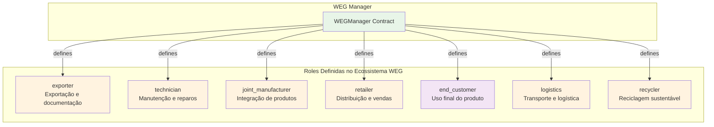

### Observações Importantes

#### **📋 Roles vs Stakeholders:**
- **Roles**: Definem TIPOS de participantes (templates)
- **Stakeholders**: São pessoas/empresas específicas atribuídas a uma role

#### **🔐 Hierarquia de Criação:**
1. ✅ **Schemas EAS**: Tipos de attestations possíveis
2. ✅ **Roles**: Tipos de participantes possíveis  
3. ⏳ **Stakeholders**: Pessoas/empresas específicas com roles e permissões

#### **🎯 Próximos Passos:**
- ⏳ **Cadastro de Stakeholders**: Atribuir pessoas/empresas específicas às roles criadas
- ⏳ **Definição de Permissões**: Mapear quais roles podem usar quais schemas
- ⏳ **Criação de Produtos**: Usar a factory para criar passaportes
- ⏳ **Attestations**: Stakeholders criam attestations baseados em suas permissões

---

## 10. Cadastro de Stakeholders - WEG

### Visão Geral
Agora que o WEG Manager está criado, os schemas EAS foram criados, e as roles foram definidas com suas permissões, a WEG pode cadastrar stakeholders específicos atribuindo-os às roles. As permissões vêm automaticamente da role atribuída.

### Diagrama de Sequência - Cadastro de Stakeholders WEG

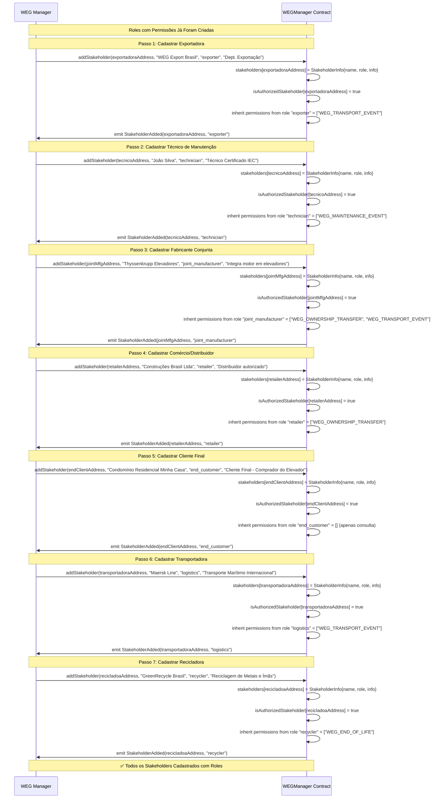

### Detalhes dos Stakeholders Cadastrados

#### **1️⃣ Exportadora WEG**
- **Nome**: "WEG Export Brasil"
- **Role Atribuída**: `exporter`
- **Permissões Herdadas**: `["WEG_TRANSPORT_EVENT"]` (da role exporter)
- **Função**: Registrar eventos de transporte para exportação
- **Info Adicional**: "Dept. Exportação"

#### **2️⃣ Técnico de Manutenção**
- **Nome**: "João Silva"
- **Role Atribuída**: `technician`
- **Permissões Herdadas**: `["WEG_MAINTENANCE_EVENT"]` (da role technician)
- **Função**: Registrar início e fim de manutenções
- **Info Adicional**: "Técnico Certificado IEC"

#### **3️⃣ Fabricante Conjunta**
- **Nome**: "Thyssenkrupp Elevadores"
- **Role Atribuída**: `joint_manufacturer`
- **Permissões Herdadas**: `["WEG_OWNERSHIP_TRANSFER", "WEG_TRANSPORT_EVENT"]` (da role joint_manufacturer)
- **Função**: Registrar recebimento do motor e transporte do elevador
- **Info Adicional**: "Integra motor em elevadores"

#### **4️⃣ Comércio/Distribuidor**
- **Nome**: "Construções Brasil Ltda"
- **Role Atribuída**: `retailer`
- **Permissões Herdadas**: `["WEG_OWNERSHIP_TRANSFER"]` (da role retailer)
- **Função**: Registrar venda do elevador para cliente final
- **Info Adicional**: "Distribuidor autorizado"

#### **5️⃣ Cliente Final**
- **Nome**: "Condomínio Residencial Minha Casa"
- **Role Atribuída**: `end_customer`
- **Permissões Herdadas**: `[]` (da role end_customer - apenas consulta)
- **Função**: Receber e usar o elevador (apenas consulta)
- **Info Adicional**: "Cliente Final - Comprador do Elevador"

#### **6️⃣ Transportadora**
- **Nome**: "Maersk Line"
- **Role Atribuída**: `logistics`
- **Permissões Herdadas**: `["WEG_TRANSPORT_EVENT"]` (da role logistics)
- **Função**: Registrar eventos de transporte internacional
- **Info Adicional**: "Transporte Marítimo Internacional"

#### **7️⃣ Recicladora**
- **Nome**: "GreenRecycle Brasil"
- **Role Atribuída**: `recycler`
- **Permissões Herdadas**: `["WEG_END_OF_LIFE"]` (da role recycler)
- **Função**: Registrar finalização e descarte do produto
- **Info Adicional**: "Reciclagem de Metais e Ímãs"

---

## 11. Estado Final dos Stakeholders WEG

### Resultado da Configuração

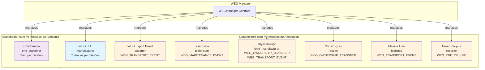

### Observações Importantes

#### **🔐 Sistema de Permissões Baseado em Roles:**
- **Roles definem permissões**: Cada role tem schemas específicos que pode usar
- **Stakeholders herdam permissões**: Quando atribuído a uma role, stakeholder ganha suas permissões
- **Gerenciamento centralizado**: Mudanças na role afetam todos os stakeholders dessa role
- **Escalabilidade**: Novos stakeholders só precisam ser atribuídos a roles existentes

#### **🎯 Mapeamento Role → Permissões:**
- **`exporter`** → `["WEG_TRANSPORT_EVENT"]`
- **`technician`** → `["WEG_MAINTENANCE_EVENT"]`
- **`joint_manufacturer`** → `["WEG_OWNERSHIP_TRANSFER", "WEG_TRANSPORT_EVENT"]`
- **`retailer`** → `["WEG_OWNERSHIP_TRANSFER"]`
- **`logistics`** → `["WEG_TRANSPORT_EVENT"]`
- **`recycler`** → `["WEG_END_OF_LIFE"]`
- **`end_customer`** → `[]` (apenas consulta)

#### **🏭 Cadeia de Valor com Roles:**
1. **WEG** (manufacturer) → Fabrica motor (`WEG_PRODUCT_INIT`)
2. **Thyssenkrupp** (joint_manufacturer) → Recebe motor e transporta elevador
3. **Construções Brasil** (retailer) → Vende elevador
4. **Condomínio** (end_customer) → Usa o elevador (consulta apenas)
5. **Maersk/WEG Export** (logistics/exporter) → Transporta
6. **João Silva** (technician) → Faz manutenções
7. **GreenRecycle** (recycler) → Recicla no fim da vida

#### **✅ Vantagens do Sistema de Roles:**
- **Consistência**: Todos stakeholders da mesma role têm mesmas permissões
- **Manutenibilidade**: Alterar uma role atualiza todos seus stakeholders
- **Segurança**: Permissões centralizadas e auditáveis
- **Flexibilidade**: Stakeholders podem mudar de role se necessário

#### **🎯 Próximos Passos:**
- ⏳ **Criação de Produtos**: Usando a factory para criar passaportes
- ⏳ **Attestations Práticas**: Stakeholders criam attestations baseados em suas roles
- ⏳ **Consultas**: Demonstrar como consultar o histórico completo

---

## 12. Criação de um Produto - Motor WEG W22 100HP

### Visão Geral
Agora que toda a infraestrutura está pronta (schemas, roles, stakeholders), a WEG pode criar um produto específico usando a DigitalPassportFactory e inicializar seu passaporte digital com a primeira attestation.

### Diagrama de Sequência - Criação de Produto

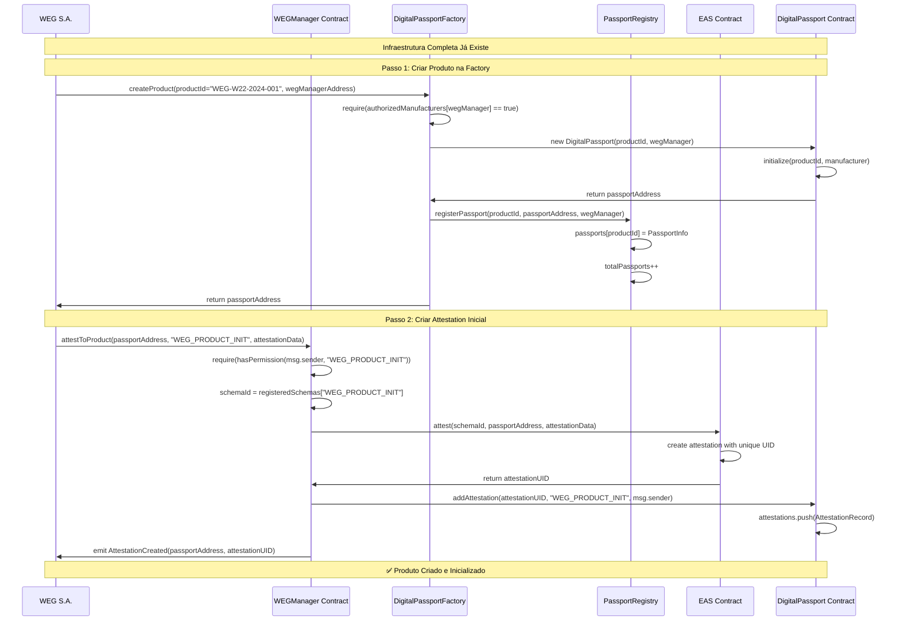

### Detalhes do Produto Criado

#### **📋 Informações do Produto:**
- **Product ID**: `WEG-W22-2024-001`
- **Modelo**: Motor Elétrico WEG W22 100HP
- **Número de Série**: `WEG2024001`
- **Manufacturer**: WEG S.A.
- **Passport Address**: `0x123...abc` (endereço único do contrato)

#### **🏭 Dados da Attestation Inicial (WEG_PRODUCT_INIT):**
```json
{
  "productModel": "WEG W22 100HP",
  "serialNumber": "WEG2024001", 
  "timestamp": 1704067200,
  "composition": "Motor trifásico, carcaça ferro fundido, rotor alumínio, imãs neodímio",
  "suppliers": [
    "Fornecedor Aço Brasil Ltda",
    "Magnetos do Sul S.A.",
    "Bobinagem Técnica Jaraguá"
  ],
  "manufacturingLocation": "Jaraguá do Sul, Santa Catarina, Brasil",
  "qualityStandards": "IEC 60034, NEMA MG-1, ISO 9001:2015"
}
```

### Estados dos Sistemas Após Criação

#### **🏗️ PassportRegistry:**
- `totalPassports`: 1
- `passports["WEG-W22-2024-001"]`: 
  - `passportAddress`: `0x123...abc`
  - `manufacturer`: `wegManagerAddress`
  - `createdAt`: timestamp
  - `isActive`: true

#### **📄 DigitalPassport Contract:**
- **Product ID**: `WEG-W22-2024-001`
- **Manufacturer**: `wegManagerAddress`
- **Total Attestations**: 1
- **Attestations Array**:
  - `[0]`: AttestationRecord{uid, schemaType, attester, timestamp}

#### **🌐 EAS Contract:**
- **Nova Attestation Criada**:
  - **UID**: Identificador único gerado pelo EAS
  - **Schema**: `WEG_PRODUCT_INIT`
  - **Recipient**: `passportAddress`
  - **Attester**: `wegAddress`
  - **Data**: Dados JSON codificados

---

## 13. Estado Atual do Ecossistema

### Resultado da Configuração

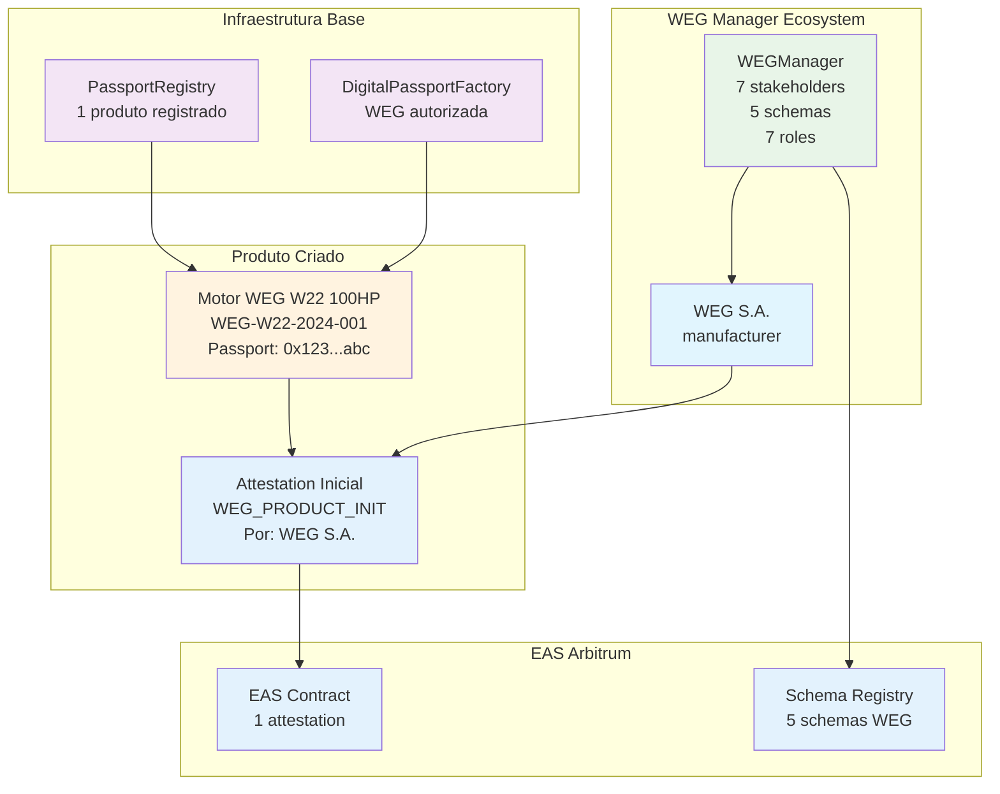

### Observações Importantes

#### **✅ Produto Pronto para a Cadeia:**
- ✅ **Passport Digital**: Contrato único criado na blockchain
- ✅ **Attestation Inicial**: Dados de fabricação registrados
- ✅ **Registrado**: Disponível para consulta no registry
- ✅ **Rastreável**: Pronto para receber novas attestations da cadeia

#### **🔐 Permissões Ativas:**
- **WEG S.A.**: Pode criar qualquer attestation para este produto
- **Outros Stakeholders**: Podem criar attestations conforme suas roles permitirem
- **Consultas**: Qualquer pessoa pode consultar o histórico (dados públicos)

#### **🎯 Próximos Passos:**
- ⏳ **Fluxo de Attestations**: Stakeholders da cadeia criam suas attestations
- ⏳ **Transferências de Propriedade**: Produto muda de dono na cadeia
- ⏳ **Eventos de Transporte**: Movimentação entre locais
- ⏳ **Manutenções**: Registros ao longo da vida útil
- ⏳ **Consultas**: Como diferentes stakeholders veem o produto

---

## 14. Fluxo Completo de Attestations - Ciclo de Vida do Motor

### Visão Geral
Agora vamos acompanhar o Motor WEG W22 100HP (ID: WEG-W22-2024-001) ao longo de sua vida útil, mostrando como cada stakeholder cria attestations conforme suas permissões e responsabilidades.

### Diagrama de Sequência - Ciclo de Vida Completo

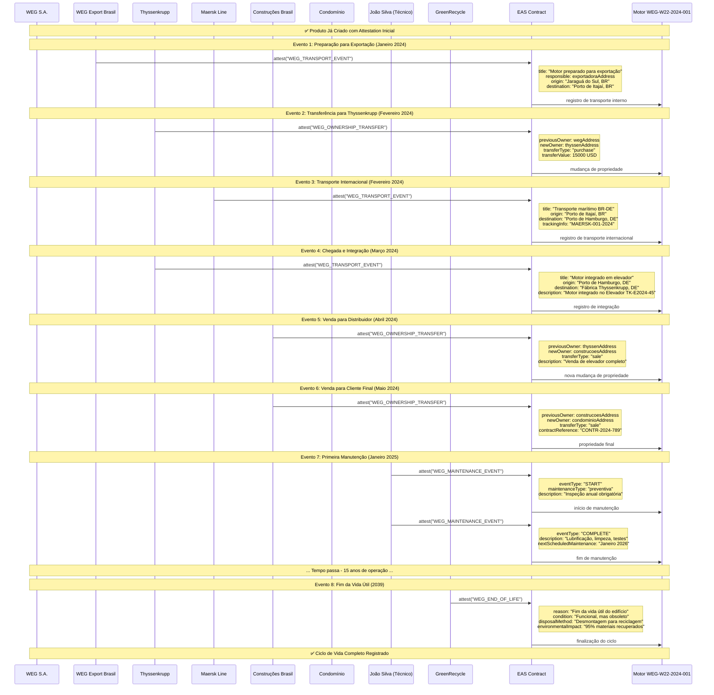

### Detalhes das Attestations Criadas

#### **📋 Histórico Cronológico do Motor WEG-W22-2024-001:**

#### **Evento 1: Preparação para Exportação (Janeiro 2024)**
- **Stakeholder**: WEG Export Brasil (role: `exporter`)
- **Schema**: `WEG_TRANSPORT_EVENT`
- **Dados**:
  ```json
  {
    "title": "Motor preparado para exportação",
    "responsible": "0xExportadora...",
    "recipient": "0x0",
    "timestamp": 1704672000,
    "description": "Motor embalado e preparado para transporte ao porto",
    "origin": "Jaraguá do Sul, Santa Catarina, Brasil",
    "destination": "Porto de Itajaí, Santa Catarina, Brasil",
    "trackingInfo": "WEG-EXP-2024-001"
  }
  ```

#### **Evento 2: Transferência de Propriedade (Fevereiro 2024)**
- **Stakeholder**: Thyssenkrupp Elevadores (role: `joint_manufacturer`)
- **Schema**: `WEG_OWNERSHIP_TRANSFER`
- **Dados**:
  ```json
  {
    "previousOwner": "0xWEG...",
    "newOwner": "0xThyssenkrupp...",
    "timestamp": 1707264000,
    "transferType": "purchase",
    "contractReference": "TK-WEG-CONTRACT-2024-15",
    "transferValue": 15000,
    "description": "Compra de motor para integração em elevador modelo TK-E2024-45"
  }
  ```

#### **Evento 3: Transporte Internacional (Fevereiro 2024)**
- **Stakeholder**: Maersk Line (role: `logistics`)
- **Schema**: `WEG_TRANSPORT_EVENT`
- **Dados**:
  ```json
  {
    "title": "Transporte marítimo Brasil-Alemanha",
    "responsible": "0xMaersk...",
    "recipient": "0xThyssenkrupp...",
    "timestamp": 1707868800,
    "description": "Transporte marítimo em container refrigerado",
    "origin": "Porto de Itajaí, Santa Catarina, Brasil",
    "destination": "Porto de Hamburgo, Alemanha",
    "trackingInfo": "MAERSK-CONTAINER-2024-001"
  }
  ```

#### **Evento 4: Integração no Produto Final (Março 2024)**
- **Stakeholder**: Thyssenkrupp Elevadores (role: `joint_manufacturer`)
- **Schema**: `WEG_TRANSPORT_EVENT`
- **Dados**:
  ```json
  {
    "title": "Motor integrado em elevador completo",
    "responsible": "0xThyssenkrupp...",
    "recipient": "0xThyssenkrupp...",
    "timestamp": 1709856000,
    "description": "Motor WEG integrado no elevador TK-E2024-45 para edifício residencial",
    "origin": "Porto de Hamburgo, Alemanha",
    "destination": "Fábrica Thyssenkrupp, Neuhausen, Alemanha",
    "trackingInfo": "TK-INTEGRATION-2024-45"
  }
  ```

#### **Eventos 5-6: Vendas na Cadeia (Abril-Maio 2024)**
- **Construções Brasil** registra recebimento do elevador
- **Construções Brasil** registra venda para cliente final (Condomínio)

#### **Evento 7: Manutenção Preventiva (Janeiro 2025)**
- **Stakeholder**: João Silva (role: `technician`)
- **Schema**: `WEG_MAINTENANCE_EVENT`
- **2 Attestations**: START e COMPLETE da manutenção

#### **Evento 8: Fim da Vida Útil (2039)**
- **Stakeholder**: GreenRecycle (role: `recycler`)
- **Schema**: `WEG_END_OF_LIFE`
- **15 anos** de operação registrados

---

## 15. Estado Final do Produto

### Resultado do Ciclo Completo

```mermaid
graph TD
    subgraph "Histórico Completo - Motor WEG-W22-2024-001"
        INIT[2024/Jan: Fabricação<br/>WEG S.A.<br/>WEG_PRODUCT_INIT]
        EXP[2024/Jan: Exportação<br/>WEG Export<br/>WEG_TRANSPORT_EVENT]
        TRANS1[2024/Fev: Transferência<br/>Thyssenkrupp<br/>WEG_OWNERSHIP_TRANSFER]
        SHIP[2024/Fev: Transporte<br/>Maersk<br/>WEG_TRANSPORT_EVENT]
        INTEG[2024/Mar: Integração<br/>Thyssenkrupp<br/>WEG_TRANSPORT_EVENT]
        SALE1[2024/Abr: Venda<br/>Construções<br/>WEG_OWNERSHIP_TRANSFER]
        SALE2[2024/Mai: Cliente Final<br/>Construções<br/>WEG_OWNERSHIP_TRANSFER]
        MAINT[2025/Jan: Manutenção<br/>João Silva<br/>WEG_MAINTENANCE_EVENT]
        EOL[2039: Fim da Vida<br/>GreenRecycle<br/>WEG_END_OF_LIFE]
    end
    
    INIT --> EXP
    EXP --> TRANS1
    TRANS1 --> SHIP
    SHIP --> INTEG
    INTEG --> SALE1
    SALE1 --> SALE2
    SALE2 --> MAINT
    MAINT --> EOL
    
    style INIT fill:#e1f5fe
    style EXP fill:#fff3e0
    style TRANS1 fill:#fff3e0
    style SHIP fill:#fff3e0
    style INTEG fill:#fff3e0
    style SALE1 fill:#fff3e0
    style SALE2 fill:#fff3e0
    style MAINT fill:#fff3e0
    style EOL fill:#f3e5f5
```

### Observações Importantes

#### **📊 Estatísticas do Produto:**
- **Total de Attestations**: 9 attestations
- **Stakeholders Únicos**: 7 diferentes
- **Países Visitados**: Brasil, Alemanha
- **Tempo de Vida**: 15 anos
- **Mudanças de Propriedade**: 3 transferências
- **Manutenções**: 1 preventiva registrada

#### **🔍 Rastreabilidade Completa:**
- ✅ **Origem**: Conhecemos todos os fornecedores de matéria-prima
- ✅ **Fabricação**: Local, padrões, qualidade documentados
- ✅ **Logística**: Rotas completas Brasil → Alemanha
- ✅ **Propriedade**: Cadeia completa WEG → Thyssenkrupp → Construções → Condomínio
- ✅ **Manutenção**: Histórico de serviços técnicos
- ✅ **Descarte**: Reciclagem responsável documentada

#### **🎯 Próximos Passos:**
- ⏳ **Consultas Específicas**: Como cada stakeholder acessa informações
- ⏳ **Relatórios Regulatórios**: Compliance com regulamentações
- ⏳ **Análise de Dados**: Insights da cadeia de suprimentos

---

**Documento**: Exemplo de Uso Multi-Fabricante  
**Status**: Ciclo de Vida Completo Documentado