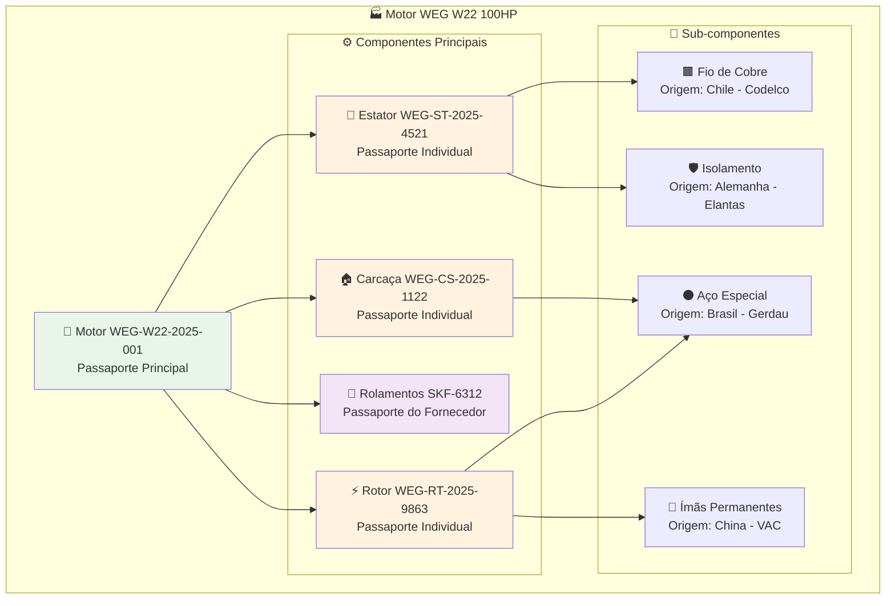
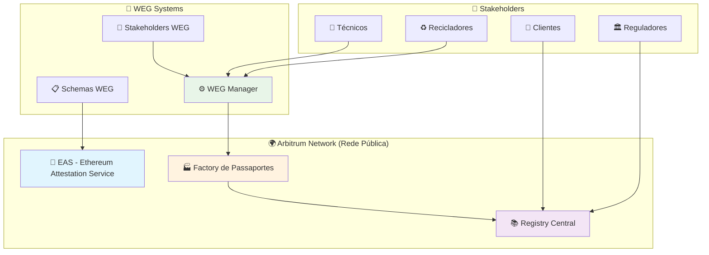
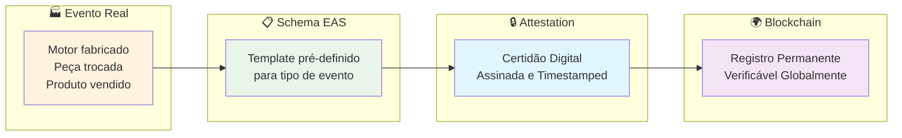

# WEG Digital Passport - Proposta de Solução
## Passaportes Digitais Industriais na Blockchain

---

## 🎯 **Resumo Executivo**

Esta é uma **proposta de solução revolucionária** de **Passaportes Digitais** para os produtos industriais da **WEG S.A.**, utilizando tecnologia blockchain para garantir **rastreabilidade completa** do ciclo de vida dos equipamentos, desde a fabricação até o descarte.

### **Problema Atual da WEG**
- ❌ **Falta de rastreabilidade**: Dificuldade para rastrear produtos ao longo de décadas
- ❌ **Documentação fragmentada**: Papéis perdidos, dados espalhados
- ❌ **Compliance regulatório**: Novas regulamentações europeias exigem rastreabilidade total
- ❌ **Manutenção ineficiente**: Histórico de manutenção incompleto ou perdido
- ❌ **Impacto ambiental**: Impossibilidade de calcular pegada de carbono real
- ❌ **Componentes não rastreáveis**: Origem e histórico de peças internas desconhecidos

### **Solução Proposta**
✅ **Passaporte Digital Imutável** para cada produto WEG  
✅ **Rastreabilidade completa** de 15+ anos de ciclo de vida  
✅ **Compliance automático** com regulamentações internacionais  
✅ **Histórico de manutenção** permanente e verificável  
✅ **Sustentabilidade** com cálculo preciso de impacto ambiental  
✅ **Rastreabilidade de componentes** desde matéria-prima até montagem final

---

## 🏭 **O Que São Passaportes Digitais Industriais?**

**Propomos criar** um **"RG digital"** para cada motor, transformador ou equipamento industrial que a WEG produz. Este passaporte conteria:

### 📋 **Informações Permanentes:**
- **Fabricação**: Matérias-primas, local, data, especificações técnicas
- **Componentes**: Rastreabilidade individual de cada peça interna
- **Transporte**: Rotas, transportadores, condições de envio
- **Instalação**: Local final, integrador, condições de operação
- **Manutenção**: Todas as intervenções, peças trocadas, técnicos responsáveis
- **Propriedade**: Histórico completo de donos e transferências
- **Fim de vida**: Reciclagem, descarte, impacto ambiental

### 🔒 **Características Únicas:**
- **Imutável**: Uma vez registrado, não pode ser alterado ou falsificado
- **Permanente**: Dados preservados por décadas, mesmo se a empresa mudar
- **Verificável**: Qualquer pessoa pode confirmar a autenticidade
- **Global**: Funciona em qualquer país do mundo
- **Automático**: Integração direta com sistemas industriais da WEG
- **Hierárquico**: Rastreabilidade desde componentes até produto final

---

## 🔧 **Rastreabilidade de Componentes Internos**

### **Estrutura Hierárquica Proposta:**

### **📊 Benefícios da Rastreabilidade de Componentes:**

#### **🔍 Para Engenharia e Qualidade:**
- **Análise de falhas**: Identificação precisa da origem de problemas
- **Controle de lotes**: Rastreamento de materiais com defeitos potenciais
- **Recall direcionado**: Apenas produtos com componentes específicos afetados
- **Otimização de fornecedores**: Dados reais de performance por fornecedor

#### **♻️ Para Sustentabilidade:**
- **Pegada de carbono precisa**: Cálculo por componente e origem
- **Reciclagem otimizada**: Conhecimento exato dos materiais presentes
- **Economia circular**: Reutilização inteligente de componentes específicos
- **Compliance de origem**: Certificação de materiais livres de conflito

#### **🔧 Para Manutenção:**
- **Peças de reposição exatas**: Identificação precisa do componente original
- **Histórico de durabilidade**: Performance real de cada tipo de peça
- **Manutenção preditiva**: Previsão de falhas baseada no histórico do componente
- **Garantia rastreável**: Verificação de origem para claims de garantia

---

## 🌍 **Por Que Arbitrum? Rede Pública vs. Privada**

### ❌ **Problemas das Redes Privadas (Permissionadas)**

#### **1. Dependência e Controle Centralizado**
- **Risco de falha**: Se a WEG sair do negócio, todos os dados podem ser perdidos
- **Controle total**: Uma única empresa decide quem pode acessar e quando
- **Falta de transparência**: Stakeholders externos não conseguem verificar independentemente

#### **2. Limitações de Interoperabilidade**
- **Ilhas isoladas**: Cada fabricante teria sua própria rede incompatível
- **Barreiras comerciais**: Dificuldade para integrar com parceiros e clientes da WEG
- **Custos duplicados**: A WEG precisaria manter sua própria infraestrutura

#### **3. Confiança Limitada**
- **"Confia, mas não verifica"**: Stakeholders precisam confiar cegamente na WEG
- **Auditoria complexa**: Reguladores precisam de acesso especial para verificar
- **Credibilidade questionável**: Dados podem ser vistos como enviesados

### ✅ **Vantagens da Rede Pública (Arbitrum)**

#### **1. Neutralidade e Credibilidade**
- **Infraestrutura neutra**: Nenhuma empresa controla a rede
- **Verificação independente**: Qualquer pessoa pode auditar os dados da WEG
- **Credibilidade internacional**: Aceita globalmente por reguladores e parceiros

#### **2. Interoperabilidade Total**
- **Padrão universal**: Todos os fabricantes usam a mesma infraestrutura
- **Integração natural**: Fornecedores, clientes e parceiros da WEG no mesmo sistema
- **Economia de rede**: Quanto mais empresas usam, maior o valor para a WEG

#### **3. Permanência e Sustentabilidade**
- **Independente da WEG**: Dados preservados mesmo se a empresa mudar de estratégia
- **Descentralização**: Milhares de validadores mantêm a rede funcionando
- **Evolução contínua**: Tecnologia melhora com investimento global

#### **4. Custos e Eficiência**
- **Infraestrutura compartilhada**: Custos divididos entre milhões de usuários
- **Arbitrum = baixo custo**: Transações 100x mais baratas que Ethereum
- **Sem manutenção**: WEG não precisa manter servidores ou infraestrutura

---

## 🏗️ **Arquitetura da Solução Proposta**

### **Componentes Principais:**

### **🔄 Fluxo de Funcionamento Proposto:**

1. **🏭 Fabricação**: WEG cria passaporte digital no momento da produção
2. **🔧 Componentes**: Cada peça interna ganha seu próprio passaporte vinculado
3. **📦 Logística**: Transportadores registram movimentações automaticamente
4. **🏢 Cliente**: Comprador recebe passaporte com histórico completo
5. **🔧 Manutenção**: Técnicos registram intervenções em tempo real
6. **♻️ Descarte**: Recicladores registram destinação final sustentável

---

## 🔏 **EAS - A Tecnologia Central da Solução**

### **O Que é a Ethereum Attestation Service (EAS)?**

A **EAS** é o **protocolo padrão mundial** para criar **"certidões digitais"** verificáveis na blockchain. Funciona como um **cartório digital descentralizado** onde qualquer evento importante pode ser registrado de forma permanente e verificável.

### **🏛️ Analogia: EAS = Cartório Digital Global**

Imagine um **cartório que nunca fecha**, **nunca perde documentos** e **qualquer pessoa no mundo pode verificar** a autenticidade dos registros:

| **Cartório Tradicional** | **EAS (Cartório Digital)** |
|--------------------------|----------------------------|
| 🏢 Horário comercial | ⏰ Funciona 24/7 |
| 📄 Documentos físicos | 🔒 Registros criptográficos |
| 🌍 Escopo local/regional | 🌎 Alcance global |
| 💰 Custos altos por documento | 💰 Custos baixíssimos |
| ❌ Pode perder documentos | ✅ Registros permanentes |
| 🤝 Requer confiança no cartório | 🔍 Verificação independente |

### **🔧 Por Que a EAS é Perfeita para Passaportes Industriais?**

#### **1. 📋 Schemas Customizáveis**
- **Modelos específicos** para cada tipo de evento industrial
- **Schemas WEG**: Fabricação, Transporte, Manutenção, Transferência, Fim de Vida
- **Flexibilidade total** para adaptar conforme necessidades da WEG

#### **2. 🛡️ Sistema de Permissões Granular**
- **Controle total**: Apenas pessoas autorizadas podem registrar eventos
- **Roles específicos**: Técnicos só podem registrar manutenção, exportadores só transporte
- **Responsabilidade clara**: Cada registro tem um responsável identificado

#### **3. 🔗 Interoperabilidade Universal**
- **Padrão aberto**: Qualquer empresa pode usar, mas dados ficam separados
- **Integração fácil**: Fornecedores, clientes e parceiros na mesma plataforma
- **Futuro-prova**: Tecnologia adotada mundialmente

#### **4. 💰 Custo-Benefício Excepcional**
- **Infraestrutura compartilhada**: Custos divididos entre milhões de usuários
- **Arbitrum**: Transações 100x mais baratas que Ethereum
- **Sem manutenção**: WEG não precisa manter servidores

### **🎯 Como a EAS Funciona na Prática para WEG?**

### **📊 Benefícios Únicos da EAS para WEG:**

#### **🔍 Transparência com Controle**
- **Metadados públicos**: Produto existe, é autêntico, tem histórico
- **Detalhes privados**: Especificações técnicas controladas pela WEG
- **Verificação independente**: Clientes podem confirmar autenticidade

#### **🏗️ Arquitetura Escalável**
- **Milhões de eventos**: Sistema suporta toda a produção WEG
- **Performance alta**: Arbitrum processa milhares de transações por segundo
- **Crescimento orgânico**: Adicionar novos tipos de evento é simples

#### **🤝 Confiança Distribuída**
- **Não depende da WEG**: Sistema funciona independentemente
- **Credibilidade global**: Aceito por reguladores internacionais
- **Auditoria automática**: Compliance verificável em tempo real

### **🚀 Por Que Não Usar Alternativas?**

| **Alternativa** | **Limitação** | **EAS** |
|-----------------|---------------|---------|
| **Banco de dados WEG** | ❌ Centralizadoة تحت السيطرة | ✅ Descentralizado e neutro |
| **APIs privadas** | ❌ Requer integração complexa | ✅ Padrão universal |
| **PDFs assinados** | ❌ Não verificável programaticamente | ✅ Verificação automática |
| **QR codes simples** | ❌ Dados podem ser alterados | ✅ Imutável e permanente |
| **Blockchain privada** | ❌ Credibilidade limitada | ✅ Credibilidade global |

### **🎯 EAS = Fundação para Inovação**

A escolha da **EAS** não é apenas técnica - é **estratégica**:

- **🏗️ Base sólida**: Protocolo maduro, testado em produção
- **🌍 Adoção crescente**: Empresas globais já utilizando
- **🔮 Futuro garantido**: Ethereum Foundation mantém o padrão
- **🤝 Ecossistema ativo**: Ferramentas e integrações em constante evolução

---

## 💼 **Benefícios de Negócio para a WEG**

### **Para a WEG:**
- 🎯 **Diferenciação competitiva**: Primeira a oferecer rastreabilidade total
- 📈 **Premium pricing**: Produtos com passaporte podem ter valor superior
- 🤝 **Confiança do cliente**: Transparência total gera confiança
- 📊 **Dados valiosos**: Insights sobre uso real dos produtos
- 🌱 **Sustentabilidade**: Liderança em responsabilidade ambiental
- 🔍 **Qualidade aprimorada**: Rastreabilidade de componentes melhora controle de qualidade

### **Para os Clientes da WEG:**
- 🔍 **Transparência total**: Conhecimento completo do que estão comprando
- 💰 **Valor de revenda**: Produtos com histórico verificado valem mais
- ⚡ **Manutenção otimizada**: Histórico completo para decisões inteligentes
- 📋 **Compliance automático**: Relatórios regulatórios gerados automaticamente
- 🌿 **Responsabilidade ambiental**: Contribuição verificável para sustentabilidade
- 🔧 **Peças de reposição precisas**: Identificação exata de componentes originais

### **Para a Sociedade:**
- 🌍 **Sustentabilidade real**: Rastreabilidade para economia circular
- 🏛️ **Compliance regulatório**: Atendimento automático a leis ambientais
- 💡 **Inovação**: Padrão para toda a indústria seguir
- 🤝 **Confiança**: Sistema verificável independentemente

---

## 🎯 **Exemplo Prático: Motor WEG W22 100HP**

### **📋 Ciclo de Vida Completo Proposto:**

**🏭 Julho 2025 - Fabricação (Jaraguá do Sul)**
- **Produto Principal**: Motor WEG-W22-2025-001
- **Componentes rastreados**: Estator (Chile), Rotor (Brasil), Rolamentos (SKF-Alemanha)
- Material: Aço reciclado 85%, cobre certificado livre de conflito
- Técnico responsável: João Silva (ID: WEG-001)
- Testes de qualidade: Aprovado em 15 quesitos

**📦 Agosto 2025 - Exportação**
- Transportadora: Maersk Line
- Destino: Hamburgo, Alemanha
- Condições: Temperatura controlada
- **Componentes**: Todos os passaportes de componentes vinculados ao transporte

**🏢 Setembro 2025 - Integração**
- Cliente: Thyssenkrupp Elevadores
- Uso: Elevador em prédio comercial
- Instalador certificado: Hans Mueller
- **Rastreabilidade**: Histórico completo de origem de cada componente disponível

**🔧 2025-2040 - Manutenções**
- 15 anos de histórico completo
- **Peças trocadas rastreáveis**: Cada componente substituído com passaporte próprio
- Eficiência energética monitorada
- **Análise de falhas**: Identificação precisa de componentes com problemas

**♻️ 2040 - Reciclagem**
- 95% dos materiais recuperados
- **Separação inteligente**: Cada material identificado por origem e composição
- Impacto de carbono: -2.3 ton CO₂
- Novo ciclo: Materiais para novos motores com rastreabilidade preservada

---

## 📊 **Comparação: Método Atual vs. Solução Proposta**

| Aspecto | **Método Atual WEG** | **Digital Passport Proposto** |
|---------|------------------------|----------------------|
| **Rastreabilidade** | ❌ Limitada, papéis perdidos | ✅ Completa, 15+ anos |
| **Componentes** | ❌ Não rastreáveis | ✅ Cada peça rastreada individualmente |
| **Verificação** | ❌ Difícil, documentos físicos | ✅ Instantânea, blockchain |
| **Compliance** | ❌ Manual, custoso | ✅ Automático, em tempo real |
| **Valor de revenda** | ❌ Baixo, sem histórico | ✅ Alto, histórico verificado |
| **Sustentabilidade** | ❌ Não rastreável | ✅ Pegada de carbono precisa |
| **Confiança** | ❌ "Confia, mas não verifica" | ✅ "Não precisa confiar, pode verificar" |
| **Interoperabilidade** | ❌ Sistema isolado | ✅ Padrão universal |
| **Custos de infraestrutura** | ❌ Alto, WEG mantém | ✅ Baixo, infraestrutura compartilhada |

---

## 🚀 **Roadmap de Implementação Proposto**

### **Fase 1 - Piloto (Q3-Q4 2025)**
- ✅ **Infraestrutura básica** na Arbitrum
- ✅ **100 motores WEG** como teste
- ✅ **Rastreabilidade de 5 tipos de componentes** principais
- ✅ **Stakeholders principais**: Técnicos WEG, 1 cliente

### **Fase 2 - Expansão (Q1-Q2 2026)**
- 📈 **1.000 produtos** diversos (motores, transformadores)
- 🔧 **Rastreabilidade completa de componentes** (10+ tipos por produto)
- 🤝 **Parceiros integrados**: Transportadoras, instaladores, fornecedores de componentes
- 🌍 **Mercados**: Brasil + 2 países (Alemanha, Argentina)

### **Fase 3 - Escala Global (2026-2027)**
- 🌎 **Todos os produtos WEG** com passaporte digital
- 🏭 **Outros fabricantes** na mesma rede
- 📊 **Analytics avançado** e insights de mercado
- 🔗 **Integração total da cadeia de fornecimento** com componentes rastreados

---

## 💰 **Análise de Investimento para a WEG**

### **Custos Estimados:**
- **Desenvolvimento inicial**: R$ 3.5M (8 meses) - *aumentado devido à rastreabilidade de componentes*
- **Operação anual**: R$ 750K (transações + manutenção)
- **Integração sistemas**: R$ 1.5M (ERP, MES, sistemas de fornecedores)

### **Retorno Esperado:**
- **Premium pricing**: +7% no valor dos produtos (aumentado devido à rastreabilidade completa)
- **Redução custos compliance**: -40% em relatórios regulatórios
- **Redução recalls**: -60% devido à identificação precisa de lotes problemáticos
- **Novos mercados**: Acesso a clientes premium que exigem rastreabilidade total
- **Dados como produto**: Insights sobre uso real e performance de componentes

### **ROI Projetado**: **320% em 3 anos** *(aumentado devido aos benefícios adicionais)*

---

## 🌟 **Vantagens Competitivas para a WEG**

### **🥇 Pioneirismo:**
- **Primeira empresa brasileira** com passaportes digitais industriais completos
- **Referência mundial** em rastreabilidade de equipamentos e componentes
- **Padrão de mercado** que outros seguirão

### **🛡️ Proteção Futura:**
- **Compliance antecipado** com regulamentações que virão
- **Barreira de entrada** para concorrentes
- **Relacionamento mais profundo** com clientes
- **Controle total da cadeia** de fornecimento

### **🌍 Expansão Global:**
- **Credibilidade internacional** com transparência verificável
- **Acesso a mercados premium** (Europa, América do Norte)
- **Parcerias estratégicas** com empresas que valorizam sustentabilidade

---

## 🤔 **Perguntas Frequentes**

### **"E se a Arbitrum sair do ar?"**
- Arbitrum é uma rede descentralizada com milhares de validadores
- Dados também ficam na Ethereum (rede mais segura do mundo)
- Múltiplas cópias em diferentes localizações geográficas

### **"Os concorrentes da WEG terão acesso aos nossos dados?"**
- Apenas metadados básicos são públicos (produto existe, é autêntico)
- Detalhes técnicos e comerciais ficam criptografados
- WEG controla quem vê o quê em cada passaporte

### **"E se a WEG quiser migrar no futuro?"**
- Dados são exportáveis a qualquer momento
- Padrões abertos garantem portabilidade
- WEG mantém controle total sobre seus passaportes

### **"Como garantir que técnicos registrem informações corretas?"**
- Sistema de incentivos e penalidades
- Reputação dos técnicos fica registrada permanentemente
- Integração com IoT reduz necessidade de input manual

### **"Como rastrear milhares de componentes por produto?"**
- Automação total na linha de produção
- Códigos QR/RFID em cada componente
- Integração direta com sistemas MES da WEG

---

## 🏆 **Conclusão**

O **WEG Digital Passport** proposto representa uma **revolução** na indústria de equipamentos, oferecendo:

### **🎯 Para a WEG:**
- **Liderança tecnológica** e diferenciação no mercado
- **Novos modelos de negócio** baseados em dados e serviços
- **Sustentabilidade verificável** e responsabilidade ambiental
- **Controle total da qualidade** com rastreabilidade de componentes

### **🌍 Para o Mundo:**
- **Transparência total** na cadeia de suprimentos industrial
- **Economia circular** com rastreabilidade real de materiais
- **Padrão aberto** que beneficia toda a indústria
- **Sustentabilidade** com dados precisos de impacto ambiental

### **⚡ A Escolha da Arbitrum:**
A rede pública oferece **credibilidade**, **interoperabilidade** e **sustentabilidade** impossíveis de alcançar com soluções privadas, posicionando a WEG como **líder global** em transparência industrial.

---

**"Não se trata apenas de rastreabilidade - é sobre construir confiança em um mundo que precisa de mais transparência, desde a matéria-prima até o produto final."**

---

**Documento**: Proposta WEG Digital Passport  
**Data**: Junho 2025  
**Público**: Executivos WEG e Stakeholders Não-Técnicos 