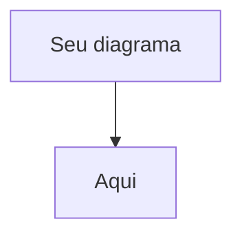

# 🎨 WEG Digital Passport - Apresentação Slidev

## 🚀 Como Usar Esta Apresentação

### **1. Executar a Apresentação**

```bash
# Iniciar servidor de desenvolvimento
npm run dev

# Ou usar yarn
yarn dev
```

A apresentação abrirá automaticamente no navegador em `http://localhost:3030`

### **2. Controles de Navegação**

| Tecla | Ação |
|-------|------|
| `→` ou `Space` | Próximo slide/animação |
| `←` | Slide anterior |
| `↑` | Primeiro slide |
| `↓` | Último slide |
| `f` | Tela cheia |
| `o` | Visão geral dos slides |
| `d` | Modo escuro |

### **3. Recursos Especiais**

#### **🎯 Apresentador**
- Pressione `p` para modo apresentador
- Mostra notas, timer e próximo slide
- Ideal para apresentações ao vivo

#### **📱 QR Codes**
- Gere QR codes reais para demo
- Use ferramentas como: https://qr-code-generator.com
- Substitua os placeholders nos slides

#### **🖼️ Imagens**
Adicione as imagens na pasta `public/`:
- `motor-qr.svg` - Motor WEG com QR Code
- `arbitrum-logo.png` - Logo Arbitrum
- `ethereum-logo.png` - Logo Ethereum  
- `qr-demo.svg` - QR Code para demonstração
- `qr-contact.svg` - QR Code para contatos

### **4. Exportar Apresentação**

```bash
# Exportar para PDF
npm run export

# Exportar para PowerPoint
npm run export -- --format pptx

# Construir versão estática
npm run build
```

### **5. Personalização**

#### **Cores WEG**
As cores já estão configuradas:
- Azul WEG: `#0066CC`
- Verde: `#00AA44`
- Vermelho: `#CC0000`

#### **Fontes e Tamanhos**
Edite diretamente no arquivo `slides.md`:
- Use classes Tailwind CSS
- `text-xl`, `text-2xl`, etc. para tamanhos
- `font-bold`, `font-semibold` para pesos

#### **Animações**
- `<v-click>` para aparecer no clique
- `<v-clicks>` para múltiplos elementos
- `v-motion` para animações avançadas

### **6. Diagramas Mermaid**

Os diagramas estão prontos, mas você pode personalizá-los:

```markdown

```

### **7. Demo Interativa**

Para criar uma demo real:

1. **Crie uma página web simples** com dados do produto
2. **Gere QR Code** apontando para essa página
3. **Substitua** `/qr-demo.svg` pelo QR real
4. **Teste** antes da apresentação

### **8. Backup da Apresentação**

#### **Opção 1: PDF**
```bash
npm run export
```

#### **Opção 2: Versão Web Estática**
```bash
npm run build
# Arquivos ficam em dist/
```

#### **Opção 3: PowerPoint**
```bash
npm run export -- --format pptx
```

### **9. Configurações Avançadas**

#### **Tema Personalizado**
No arquivo `slides.md`, altere:
```yaml
theme: default  # ou seu tema personalizado
```

#### **Plugins Úteis**
```bash
# Adicionar plugins
npm install @slidev/theme-seriph
npm install slidev-addon-qrcode
```

### **10. Checklist Pré-Apresentação**

- [ ] **Servidor funcionando** (`npm run dev`)
- [ ] **Navegação testada** (todas as teclas)
- [ ] **Imagens carregadas** (verificar pasta `public/`)
- [ ] **QR Codes funcionais** (testar com celular)
- [ ] **Demo preparada** (página web + QR)
- [ ] **Backup criado** (PDF exportado)
- [ ] **Modo apresentador** testado (`p`)
- [ ] **Timer configurado** (se necessário)
- [ ] **Tela inteira** funcionando (`f`)
- [ ] **Internet backup** (caso demo online falhe)

### **11. Dicas de Apresentação**

#### **🎯 Fluxo Ideal**
1. **Slide 1-2**: Contextualização (5 min)
2. **Slide 3-5**: Problema + Solução (10 min)
3. **Slide 6-8**: Como funciona (10 min)
4. **Slide 9-11**: Benefícios + ROI (8 min)
5. **Slide 12**: Demo ao vivo (5 min)
6. **Slide 13-15**: Próximos passos (7 min)

#### **🎬 Demo ao Vivo**
- **Prepare tudo** antes da apresentação
- **Teste QR Code** com diferentes celulares
- **Tenha backup** (screenshots/vídeo)
- **Pratique** a navegação suave

#### **📱 Interação com Audiência**
- **Slide 12**: Peça para escanearem QR
- **Pause** para perguntas nos slides importantes
- **Use controle remoto** para navegar livremente

### **12. Troubleshooting**

#### **Problema: Imagens não carregam**
```bash
# Verifique se estão na pasta correta
ls public/
```

#### **Problema: Mermaid não renderiza**
```bash
# Reinstale dependências
npm install
```

#### **Problema: Exportação falha**
```bash
# Use Chromium
npm install puppeteer
npm run export
```

### **13. Recursos Adicionais**

- **Documentação Slidev**: https://sli.dev
- **Temas**: https://sli.dev/resources/theme-gallery
- **Exemplos**: https://sli.dev/resources/showcases
- **Animações**: https://sli.dev/guide/animations

### **14. Contato Técnico**

Se houver problemas técnicos:
1. **Verifique** logs no terminal
2. **Consulte** documentação oficial
3. **Crie backup** com exportação PDF
4. **Use PowerPoint** como último recurso

---

## 🎯 **Resultado Final**

Você terá uma apresentação:
- ✅ **Profissional** e moderna
- ✅ **Interativa** com QR codes
- ✅ **Animada** suavemente
- ✅ **Exportável** em múltiplos formatos
- ✅ **Pronta** para C-Level da WEG

**🚀 Boa apresentação!** 