<style>
.arquitetura-compact {
  font-size: 0.65rem !important;
}
.arquitetura-compact h1 {
  font-size: 1.4rem !important;
  margin-bottom: 0.5rem !important;
}
.arquitetura-compact h2 {
  font-size: 1rem !important;
  margin-bottom: 0.3rem !important;
}
.arquitetura-compact h3 {
  font-size: 0.85rem !important;
  margin: 0.2rem 0 !important;
}
.arquitetura-compact ul {
  margin: 0.2rem 0 !important;
}
.arquitetura-compact li {
  margin: 0.1rem 0 !important;
  line-height: 1.2 !important;
}
.arquitetura-compact .grid {
  gap: 1rem !important;
}
</style>

<div class="arquitetura-compact">

# Digital Passport Architecture

<div class="grid grid-cols-2">

<div>

## Main Components

### 🏛️ **Base Infrastructure (Shared)**
- **PassportRegistry**: Indexing of all products
- **DigitalPassportFactory**: Controlled passport creation
- **Multi-manufacturer architecture**: WEG + other manufacturers

### ⚙️ **WEG Manager (Specific)**
- **ManufacturerManager**: Reusable abstract contract
- **WEGManager**: WEG-specific implementation
- **Role system**: Stakeholders with granular permissions

</div>

<div>

## Digital Passport Contract

**One contract per product** that stores:

- **📋 Basic Information**: Product ID, manufacturer, creation date
- **📝 Attestation List**: References to all EAS events
- **🔍 Query Functions**: History by schema, by period
- **📊 Event Log**: Chronological record of all operations

### **Each product = One unique passport**

**Note**: Access control is handled by **WEGManager** and **Resolver**

</div>

</div>

</div>

---

<style>
.manufacturer-slide {
  font-size: 0.65rem !important;
}
.manufacturer-slide h1 {
  font-size: 1.4rem !important;
  margin-bottom: 0.6rem !important;
}
.manufacturer-slide h2 {
  font-size: 1rem !important;
  margin-bottom: 0.3rem !important;
}
.manufacturer-slide h3 {
  font-size: 0.85rem !important;
  margin: 0.2rem 0 !important;
}
.manufacturer-slide pre {
  font-size: 0.55rem !important;
  padding: 0.3rem !important;
}
.manufacturer-slide .grid {
  gap: 0.8rem !important;
}
</style>

<div class="manufacturer-slide">

# ManufacturerManager: Reusable Pattern

<div class="grid grid-cols-2">

<div>

## Abstract Contract

```solidity
abstract contract ManufacturerManager {
  // Manufacturer information
  address public manufacturer;
  string public manufacturerName;
  string public manufacturerCountry;
  
  // Permission system
  mapping(string => RoleInfo) public roles;
  mapping(address => StakeholderInfo) stakeholders;
  mapping(string => bytes32) registeredSchemas;
  
  // Abstract functions (each manufacturer implements)
  function _initializeSchemas() internal virtual;
  function _createRoles() internal virtual;
  
  // Standardized functions (all use the same)
  function createRole(name, description, schemas);
  function addStakeholder(address, name, role);
  function hasPermission(stakeholder, schema) bool;
  function createSchema(name, schemaDefinition) returns (bytes32);
}
```

</div>

<div>

## WEGManager: Specific Implementation

```solidity
contract WEGManager is ManufacturerManager {
  
  constructor(factory, eas, registry, wegWallet) {
    manufacturer = wegWallet;
    manufacturerName = "WEG S.A.";
    manufacturerCountry = "Brasil";
    
    _initializeSchemas(); // 5 initial WEG schemas
    _createRoles();       // 7 WEG roles
  }
  
  // WEG defines its own initial schemas
  function _initializeSchemas() internal override {
    WEG_PRODUCT_INIT_SCHEMA = 
      createSchema("product_init", productInitDefinition);
    WEG_TRANSPORT_EVENT_SCHEMA = 
      createSchema("transport_event", transportDefinition);
    // ... other 3 initial schemas
  }
  
  // WEG can add new schemas anytime
  function addNewSchema(string name, string definition) 
    public onlyManufacturer returns (bytes32) {
    return createSchema(name, definition);
  }
}
```

</div>

</div>

<div class="text-center mt-4">

### **Advantage**: Other manufacturers can create their own managers reusing this pattern

</div>

</div>

---

<style>
.roles-weg-slide {
  font-size: 0.65rem !important;
}
.roles-weg-slide h1 {
  font-size: 1.4rem !important;
  margin-bottom: 0.6rem !important;
}
.roles-weg-slide h2 {
  font-size: 1rem !important;
  margin-bottom: 0.3rem !important;
}
.roles-weg-slide h3 {
  font-size: 0.85rem !important;
  margin: 0.2rem 0 !important;
}
.roles-weg-slide table {
  font-size: 0.6rem !important;
}
.roles-weg-slide ul {
  margin: 0.15rem 0 !important;
}
.roles-weg-slide li {
  margin: 0.05rem 0 !important;
  line-height: 1.1 !important;
}
.roles-weg-slide .grid {
  gap: 0.8rem !important;
}
</style>

<div class="roles-weg-slide">

# WEG Role System

<div class="grid grid-cols-2">

<div>

## Defined Roles

| Role | Stakeholder | Allowed Schemas |
|------|------------------|-------------------|
| **🏭 manufacturer** | WEG S.A. | All (5 schemas) |
| **🔧 maintenance_technician** | Authorized technicians | MAINTENANCE_EVENT only |
| **🚛 logistics_provider** | Transport companies | TRANSPORT_EVENT only |
| **👥 distributor** | Product distributors | OWNERSHIP_TRANSFER only |
| **🏪 end_customer** | Final customers | Query only (no creation) |
| **♻️ recycling_facility** | Recycling centers | END_OF_LIFE only |
| **🏛️ auditor** | External auditors | Query only (all data) |

### **Note**: Each stakeholder can only create the type of event they are authorized for

</div>

<div>

## System Advantages

### **🎯 Granular Permissions**
- Each stakeholder can only register events within their responsibility
- Technicians cannot change ownership
- Carriers cannot perform maintenance

### **📈 Scalability**
- New stakeholders only need to be assigned to existing roles
- Role changes affect all stakeholders automatically

### **🔒 Security**
- Automatic validation before creating any record
- Audit trail of who did what

</div>

</div>

</div>

---

<style>
.sequence-diagram {
  font-size: 0.75rem !important;
}
.sequence-diagram h1 {
  font-size: 1.6rem !important;
  margin-bottom: 0.5rem !important;
}
.sequence-diagram .mermaid {
  transform: scale(0.8) !important;
  transform-origin: center top !important;
}
.sequence-diagram p {
  font-size: 0.9rem !important;
  margin-top: 0.5rem !important;
}
</style>

<div class="sequence-diagram">

# Product Creation Flow

```mermaid
sequenceDiagram
    participant WEG as WEG S.A.
    participant Factory as DigitalPassportFactory
    participant Registry as PassportRegistry
    participant Passport as DigitalPassport
    participant Resolver as Resolver

    Note over WEG,Resolver: 1. Create Product
    WEG->>Factory: createProduct("WEG-W22-2024-001", wegManager)
    Factory->>Passport: new DigitalPassport(productId, wegManager)
    Factory->>Registry: registerPassport(productId, passportAddress)
    
    Note over WEG,Resolver: 2. First Attestation
    WEG->>Resolver: attest(WEG_PRODUCT_INIT_SCHEMA, productData)
    Resolver->>Passport: addAttestation(attestationUID, "WEG_PRODUCT_INIT")
    
    Note over WEG,Resolver: ✅ Product created with active digital passport
```



**Result**: Product with unique digital identity on blockchain, ready to receive supply chain events

</div>

---

<style>
.hierarchy-slide {
  font-size: 0.85rem !important;
}
.hierarchy-slide h1 {
  font-size: 1.8rem !important;
  margin-bottom: 0.8rem !important;
}
.hierarchy-slide h2 {
  font-size: 1.2rem !important;
  margin-bottom: 0.4rem !important;
}
.hierarchy-slide h3 {
  font-size: 1rem !important;
  margin: 0.3rem 0 !important;
}
.hierarchy-slide ul {
  margin: 0.2rem 0 !important;
}
.hierarchy-slide li {
  margin: 0.1rem 0 !important;
  line-height: 1.3 !important;
}
.hierarchy-slide .grid {
  gap: 1.5rem !important;
}
</style>

<div class="hierarchy-slide">

# Hierarchical Traceability

<div class="grid grid-cols-2">

<div>

## Multi-Level Structure

### **🔌 Main Product**
- WEG W22 100HP Motor
- Main digital passport
- Reference to all components

### **⚙️ Components**
- Stator, Rotor, Housing, Bearings
- Each with its own passport
- Linked to main product

### **🔩 Sub-components**
- Copper (Codelco), Steel (Gerdau), Magnets, Insulation
- Traceability to raw materials
- Origin certification

</div>

<div>

## Hierarchy Benefits

### **♻️ Smart Recycling**
- Exact knowledge of materials
- 95% of recoverable materials identified
- Automated sustainable destination

### **🔍 Complete Audit**
- Trail from raw materials to final product
- Conflict-free materials certification
- Automated regulatory compliance

### **💰 Added Value**
- Products with history sell at premium prices
- Reduced insurance costs
- Predictive maintenance based on real data

</div>

</div>

</div> 