<style>
.arquitetura-compact {
  font-size: 0.65rem !important;
}
.arquitetura-compact h1 {
  font-size: 1.4rem !important;
  margin-bottom: 0.5rem !important;
}
.arquitetura-compact h2 {
  font-size: 1rem !important;
  margin-bottom: 0.3rem !important;
}
.arquitetura-compact h3 {
  font-size: 0.85rem !important;
  margin: 0.2rem 0 !important;
}
.arquitetura-compact ul {
  margin: 0.2rem 0 !important;
}
.arquitetura-compact li {
  margin: 0.1rem 0 !important;
  line-height: 1.2 !important;
}
.arquitetura-compact .grid {
  gap: 1rem !important;
}
</style>

<div class="arquitetura-compact">

# Digital Passport Architecture

<div class="grid grid-cols-2">

<div>

## Main Components

### 🏛️ **Base Infrastructure (Shared)**
- **PassportRegistry**: Indexing of all products
- **DigitalPassportFactory**: Controlled passport creation
- **eIDASQualifiedAttestor**: Qualified signatures system
- **Multi-manufacturer architecture**: WEG + other manufacturers

### ⚙️ **WEG Manager (eIDAS-Enhanced)**
- **ManufacturerManager**: Reusable abstract contract
- **WEGManager**: WEG-specific implementation with eIDAS
- **Role system**: LoA-based permissions + qualified signatures
- **QTSP Integration**: European trust service providers

</div>

<div>

## Digital Passport Contract (eIDAS-Compatible)

**One contract per product** that stores:

- **📋 Basic Information**: Product ID, manufacturer, creation date
- **📝 Attestation List**: References to all EAS events + qualified attestations
- **🔐 eIDAS Information**: LoA levels, QTSP data, qualified signatures
- **🔍 Query Functions**: History by schema, by LoA level, by period
- **📊 Event Log**: Chronological record with legal validation status
- **⚖️ LTV Validation**: Long-term validation scheduling and results

### **Each product = One unique passport with EU legal recognition**

**Note**: Access control includes **LoA requirements** and **qualified signature validation**

</div>

</div>

</div>

---

<style>
.manufacturer-slide {
  font-size: 0.65rem !important;
}
.manufacturer-slide h1 {
  font-size: 1.4rem !important;
  margin-bottom: 0.6rem !important;
}
.manufacturer-slide h2 {
  font-size: 1rem !important;
  margin-bottom: 0.3rem !important;
}
.manufacturer-slide h3 {
  font-size: 0.85rem !important;
  margin: 0.2rem 0 !important;
}
.manufacturer-slide pre {
  font-size: 0.55rem !important;
  padding: 0.3rem !important;
}
.manufacturer-slide .grid {
  gap: 0.8rem !important;
}
</style>

<div class="manufacturer-slide">

# ManufacturerManager: Reusable Pattern

<div class="grid grid-cols-2">

<div>

## Abstract Contract

```solidity
abstract contract ManufacturerManager {
  // Manufacturer information
  address public manufacturer;
  string public manufacturerName;
  string public manufacturerCountry;
  
  // eIDAS Integration
  eIDASQualifiedAttestor public immutable eidasAttestor;
  
  // Enhanced permission system with LoA
  mapping(string => RoleInfo) public roles; // includes requiredLoA
  mapping(address => StakeholderInfo) stakeholders; // includes currentLoA
  mapping(string => SchemaInfo) registeredSchemas; // includes minimumLoA
  
  // Abstract functions (each manufacturer implements)
  function _initializeSchemas() internal virtual;
  function _createRoles() internal virtual;
  
  // Enhanced functions with eIDAS support
  function createRole(name, description, schemas, requiredLoA, requiresQualifiedSig);
  function addStakeholder(address, name, role, additionalInfo);
  function assignQualifiedCertificate(stakeholder, certHash, qtspName, loa);
  function hasPermission(stakeholder, schema) bool; // checks LoA
  function attestToProduct(passport, schema, data, useQualifiedSig, sigFormat);
}
```

</div>

<div>

## WEGManager: Specific Implementation

```solidity
contract WEGManager is ManufacturerManager {
  
  constructor(factory, eidasAttestor, wegWallet) {
    manufacturer = wegWallet;
    manufacturerName = "WEG S.A.";
    manufacturerCountry = "BR"; // ISO 3166-1 for eIDAS
    
    _initializeWEGSchemas(); // 5 schemas with LoA requirements
    _initializeWEGRoles();   // 8 roles with eIDAS support
  }
  
  // WEG schemas with eIDAS requirements
  function _initializeWEGSchemas() internal override {
    registerSchema("WEG_PRODUCT_INIT", schemaId, definition, 
                   2, true); // High LoA + Qualified signature required
    registerSchema("WEG_TRANSPORT_EVENT", schemaId, definition,
                   1, true); // Substantial LoA + Qualified signature
    registerSchema("WEG_OWNERSHIP_TRANSFER", schemaId, definition,
                   2, true); // High LoA for legal transfers
    registerSchema("WEG_MAINTENANCE_EVENT", schemaId, definition,
                   1, false); // Substantial LoA, regular signature OK
    registerSchema("WEG_END_OF_LIFE", schemaId, definition,
                   2, true); // High LoA for environmental compliance
  }
  
  // Enhanced product creation with eIDAS
  function createWEGProduct(productId, model, serialNumber, 
                           composition, suppliers, location, 
                           standards, useQualifiedSignature) {
    address passport = factory.createProduct(productId, address(this));
    attestToProduct(passport, "WEG_PRODUCT_INIT", data, 
                   useQualifiedSignature, "CAdES");
  }
}
```

</div>

</div>

<div class="text-center mt-4">

### **Advantage**: Other manufacturers can create their own managers reusing this pattern

</div>

</div>

---

<style>
.roles-weg-slide {
  font-size: 0.65rem !important;
}
.roles-weg-slide h1 {
  font-size: 1.4rem !important;
  margin-bottom: 0.6rem !important;
}
.roles-weg-slide h2 {
  font-size: 1rem !important;
  margin-bottom: 0.3rem !important;
}
.roles-weg-slide h3 {
  font-size: 0.85rem !important;
  margin: 0.2rem 0 !important;
}
.roles-weg-slide table {
  font-size: 0.6rem !important;
}
.roles-weg-slide ul {
  margin: 0.15rem 0 !important;
}
.roles-weg-slide li {
  margin: 0.05rem 0 !important;
  line-height: 1.1 !important;
}
.roles-weg-slide .grid {
  gap: 0.8rem !important;
}
</style>

<div class="roles-weg-slide">

# WEG Role System + eIDAS

<div class="grid grid-cols-2">

<div>

## Enhanced Roles with LoA

| Role | LoA | Qualified Sig | Allowed Schemas |
|------|-----|---------------|-----------------|
| **🏭 manufacturer** | High (2) | ✅ Required | All (5 schemas) |
| **📦 exporter** | Substantial (1) | ✅ Required | TRANSPORT_EVENT |
| **🔧 technician** | Substantial (1) | ❌ Regular OK | MAINTENANCE_EVENT |
| **🏢 joint_manufacturer** | High (2) | ✅ Required | OWNERSHIP + TRANSPORT |
| **🏪 retailer** | Substantial (1) | ✅ Required | OWNERSHIP_TRANSFER |
| **🚛 logistics** | Substantial (1) | ❌ Regular OK | TRANSPORT_EVENT |
| **♻️ recycler** | High (2) | ✅ Required | END_OF_LIFE |
| **👥 end_customer** | None (0) | ❌ Read-only | Query only |

### **Note**: LoA and signature requirements enforced by smart contracts

</div>

<div>

## eIDAS Advantages

### **⚖️ Legal Validity**
- Qualified signatures have **legal value** in EU
- Automatic **cross-border recognition** in 27+ countries
- **Regulatory compliance** built-in

### **🔐 Enhanced Security**
- **Multi-level authentication** (LoA 1 & 2)
- **QTSP certificate validation** in real-time
- **Long-term validation** (LTV) for evidence preservation

### **📈 Trust & Scalability**
- **Certificate-based trust** rather than manual verification
- **Automatic LoA enforcement** by smart contracts
- **Reduced legal risks** in international operations

</div>

</div>

</div>

---

<style>
.sequence-diagram {
  font-size: 0.75rem !important;
}
.sequence-diagram h1 {
  font-size: 1.6rem !important;
  margin-bottom: 0.5rem !important;
}
.sequence-diagram .mermaid {
  transform: scale(0.8) !important;
  transform-origin: center top !important;
}
.sequence-diagram p {
  font-size: 0.9rem !important;
  margin-top: 0.5rem !important;
}
</style>

<div class="sequence-diagram">

# Product Creation Flow

```mermaid
sequenceDiagram
    participant WEG as WEG S.A.
    participant Factory as DigitalPassportFactory
    participant Registry as PassportRegistry
    participant Passport as DigitalPassport
    participant Resolver as Resolver

    Note over WEG,Resolver: 1. Create Product
    WEG->>Factory: createProduct("WEG-W22-2024-001", wegManager)
    Factory->>Passport: new DigitalPassport(productId, wegManager)
    Factory->>Registry: registerPassport(productId, passportAddress)
    
    Note over WEG,Resolver: 2. First Attestation
    WEG->>Resolver: attest(WEG_PRODUCT_INIT_SCHEMA, productData)
    Resolver->>Passport: addAttestation(attestationUID, "WEG_PRODUCT_INIT")
    
    Note over WEG,Resolver: ✅ Product created with active digital passport
```



**Result**: Product with unique digital identity on blockchain, ready to receive supply chain events

</div>

---

<style>
.hierarchy-slide {
  font-size: 0.85rem !important;
}
.hierarchy-slide h1 {
  font-size: 1.8rem !important;
  margin-bottom: 0.8rem !important;
}
.hierarchy-slide h2 {
  font-size: 1.2rem !important;
  margin-bottom: 0.4rem !important;
}
.hierarchy-slide h3 {
  font-size: 1rem !important;
  margin: 0.3rem 0 !important;
}
.hierarchy-slide ul {
  margin: 0.2rem 0 !important;
}
.hierarchy-slide li {
  margin: 0.1rem 0 !important;
  line-height: 1.3 !important;
}
.hierarchy-slide .grid {
  gap: 1.5rem !important;
}
</style>

<div class="hierarchy-slide">

# Hierarchical Traceability

<div class="grid grid-cols-2">

<div>

## Multi-Level Structure

### **🔌 Main Product**
- WEG W22 100HP Motor
- Main digital passport
- Reference to all components

### **⚙️ Components**
- Stator, Rotor, Housing, Bearings
- Each with its own passport
- Linked to main product

### **🔩 Sub-components**
- Copper (Codelco), Steel (Gerdau), Magnets, Insulation
- Traceability to raw materials
- Origin certification

</div>

<div>

## Hierarchy Benefits

### **♻️ Smart Recycling**
- Exact knowledge of materials
- 95% of recoverable materials identified
- Automated sustainable destination

### **🔍 Complete Audit**
- Trail from raw materials to final product
- Conflict-free materials certification
- Automated regulatory compliance

### **💰 Added Value**
- Products with history sell at premium prices
- Reduced insurance costs
- Predictive maintenance based on real data

</div>

</div>

</div> 